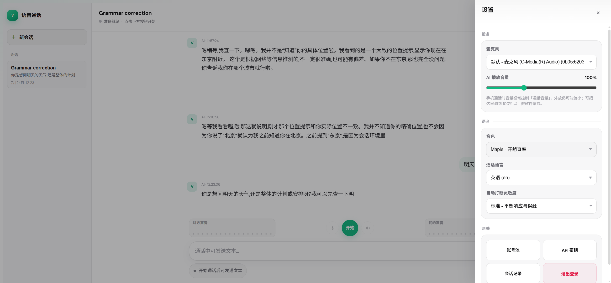
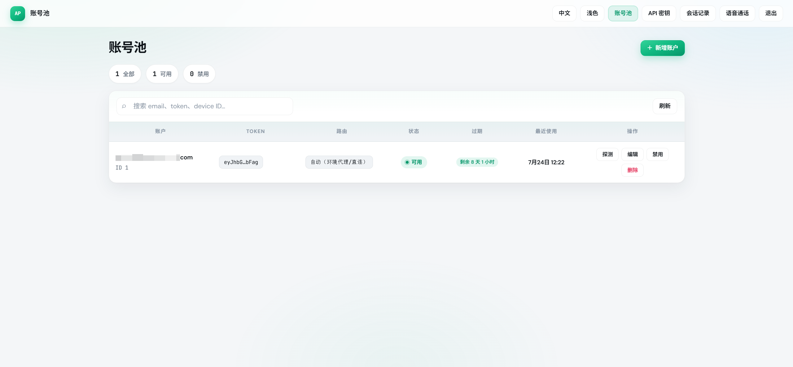
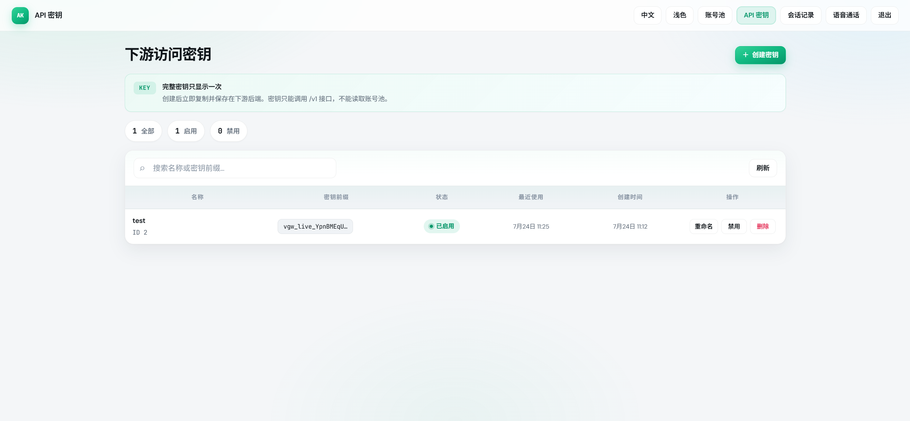
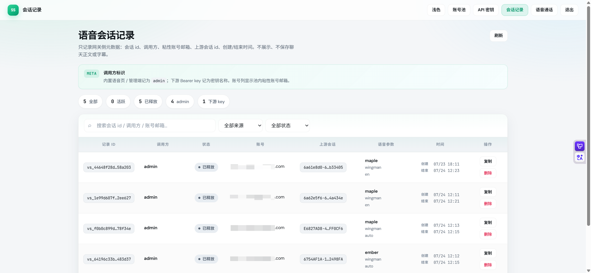

# chatgpt-web-voice

[](LICENSE)
[](https://go.dev/)
[](https://github.com/Space3044/chatgpt-web-voice/pkgs/container/chatgpt-web-voice)

自托管的 **ChatGPT.com Web Voice 网关**。

浏览器或下游后端负责 WebRTC 媒体与 DataChannel；本服务负责账号池、向 `chatgpt.com/realtime/wm` 做 SDP 信令代理、语音会话绑定，以及必要的元数据持久化。使用自有 ChatGPT Web `access_token` 池，**不需要** OpenAI 官方 Realtime API Key。账号仅使用 `access_token`，过期后需在管理端及时更换，**不会自动刷新**。上游 token 在 SQLite 中以 AES-256-GCM 密封存储，不会完整返回给浏览器或下游。

**设计边界：信令走网关，媒体由客户端直连上游。** 网关不接收、不存储原始通话音频。

## 功能概览

- 实时语音（`/realtime/wm` + WebRTC + DataChannel）
- 通话中文本与字幕（DataChannel）
- 自动打断（barge-in）
- 管理端：账号池、下游 API Key、会话元数据、内置语音页
- 下游 `/v1` 接入：只持 API Key + `voice_session_id` 即可建连 / 恢复
- 粘性账号与上游续聊线索由网关持久化，不向下游暴露池内账号信息

## 网页效果









## 本地启动

需要 Go 1.22+。

```bash
cp .env.example .env
# 必填：
#   VOICE_AUTH_USERNAME
#   VOICE_AUTH_PASSWORD
#   VOICE_TOKEN_ENCRYPTION_KEY   # openssl rand -hex 32
```

```bash
set -a && source .env && set +a
go run ./cmd/server
# 打开 http://127.0.0.1:8090/voice
```

或使用辅助脚本（自动加载 `.env`）：

```bash
bash ./scripts/dev.sh
```

登录后常用页面：

| 路径 | 说明 |
|---|---|
| `/voice` | 内置语音工作台 |
| `/accounts` | ChatGPT Web 账号池 |
| `/keys` | 下游 API Key（完整密钥只显示一次） |
| `/sessions` | 网关语音会话元数据（无聊天正文） |

编译二进制：

```bash
go build -buildvcs=false -o bin/server ./cmd/server
./bin/server
```

## Docker 部署

推荐使用 Docker Compose 部署。仓库根目录的 `docker-compose.yml` 已指向发布镜像：

```text
ghcr.io/space3044/chatgpt-web-voice:main
```

默认配置要点（`docker-compose.yml`）：

| 项 | 值 | 说明 |
|---|---|---|
| `image` | `ghcr.io/space3044/chatgpt-web-voice:main` | 发布镜像 |
| `pull_policy` | `always` | 每次 up 尝试拉取最新镜像 |
| `network_mode` | `host` | 共用宿主机网络，出站走宿主机透明代理（如 dae） |
| `mem_limit` | `256m` | 容器内存上限（curl-impersonate 子进程略高于纯 Go） |
| `volumes` | `./data:/app/data` | SQLite 等数据持久化 |
| `restart` | `unless-stopped` | 异常退出后自动拉起 |
| `environment` | 见下方示例 | 直接写在 compose 中，不依赖 `.env` |

host 网络下服务监听宿主机 `8090`，不再做端口映射。日志走容器 stdout，用 `docker compose logs -f` 查看。完整变量说明见下方「环境变量」。

### `docker-compose.yml` 环境变量配置

```yaml
# docker-compose.yml 公网部署必填项示例
environment:
  VOICE_AUTH_USERNAME: "your-admin"
  VOICE_AUTH_PASSWORD: "your-long-random-password"
  VOICE_TOKEN_ENCRYPTION_KEY: "your-openssl-rand-hex-32"
  VOICE_TLS: "false"
```

```bash
# 生成密封密钥（只生成一次，后续保持不变）
openssl rand -hex 32       # 后面填写至 VOICE_TOKEN_ENCRYPTION_KEY

mkdir chatgpt-web-voice

mkdir -p data

vim docker-compose.yml

docker compose up -d
```

> 后面添加添加反代，以及避免端口暴露到公网

### 常用命令

```bash
docker compose ps
docker compose logs -f chatgpt-web-voice
docker compose pull
docker compose up -d
docker compose restart chatgpt-web-voice
docker compose down
```

## 环境变量

多数运行参数已在代码或镜像里内置默认值（路径、会话 TTL、上游传输/指纹、日志格式等），**算固定默认，一般不用写**。  
这里只列**还需要你填、或仍建议按需改**的变量。

| 场景 | 怎么配 |
|---|---|
| 开发环境 | `.env`（可参考 `.env.example`） |
| 生产环境 | `docker-compose.yml` 的 `environment`（不依赖 `.env`） |

### 必填（开发 / 生产都要）

| 变量 | 说明 |
|---|---|
| `VOICE_AUTH_USERNAME` | 管理端登录用户名 |
| `VOICE_AUTH_PASSWORD` | 管理端登录密码 |
| `VOICE_TOKEN_ENCRYPTION_KEY` | 密封账号 token 的 32 字节密钥（hex 或 base64）；丢失后已存 token 无法解密 |

### 开发环境可改

| 变量 | 默认 | 何时改 |
|---|---|---|
| `VOICE_LISTEN_ADDR` | `0.0.0.0:8090` | 换本地监听地址/端口 |
| `VOICE_TLS` | `false` | 本地要进程自签 HTTPS 时改为 `true`（可用 `scripts/dev.sh --tls`） |
| `VOICE_TLS_CERT` / `VOICE_TLS_KEY` | 空 | 启用进程 TLS 时指定证书 |
| `VOICE_TLS_CERT_DIR` | `./data/certs` | 自签证书目录 |
| `VOICE_SKIP_SSL_VERIFY` | `false` | 仅 development 可临时用于上游证书排障 |
| `VOICE_LOG_LEVEL` | `info` | 需要更详细日志时改为 `debug` |
| `VOICE_LOG_FORMAT` | `json` | 想看文本日志时改为 `text` |
| `VOICE_DATA_DIR` | `./data` | 数据目录（证书、运行数据等） |
| `VOICE_DATABASE_FILE` | `./data/voice.db` | SQLite 文件路径 |
| `VOICE_STATIC_DIR` | `./static` | 前端静态资源目录（`voice.html` 等） |
| `VOICE_AUTH_SESSION_TTL_SECONDS` | `43200` | 管理端登录保持时长 |
| `VOICE_LOGIN_MAX_FAILURES` | `8` | 登录失败锁定阈值 |
| `VOICE_LOGIN_WINDOW_SECONDS` | `900` | 登录失败统计窗口 |
| `VOICE_LOGIN_LOCKOUT_SECONDS` | `900` | 登录锁定时长 |
| `VOICE_SESSION_TTL_SECONDS` | `180` | 语音内存绑定 TTL |
| `VOICE_MAX_ACCOUNT_ATTEMPTS` | `4` | 单次建连最多尝试账号数 |
| `VOICE_UPSTREAM_TRANSPORT` | `tls-client` | 可换成 `curl-impersonate` |
| `VOICE_TLS_PROFILE` | `chrome_120` | 使用 `tls-client` 时换指纹档 |
| `VOICE_IMPERSONATE` / `VOICE_CURL_IMPERSONATE_BIN` | `edge_101` / 空 | 使用 curl-impersonate 时指定配置档与二进制 |

### 生产环境可改

生产镜像已固定 `VOICE_ENV=production`、上游 `curl-impersonate`、数据路径、会话参数等。  
`docker-compose.yml` 通常只写：

| 变量 | 示例 | 说明 |
|---|---|---|
| `VOICE_AUTH_USERNAME` | `your-admin` | 必填 |
| `VOICE_AUTH_PASSWORD` | 长随机口令 | 必填 |
| `VOICE_TOKEN_ENCRYPTION_KEY` | `openssl rand -hex 32` | 必填，且后续保持不变 |
| `VOICE_TLS` | `false` | 有 Caddy/Nginx 时关闭容器内 TLS |

可选覆盖：

| 变量 | 何时改 |
|---|---|
| `VOICE_LOG_LEVEL` | 生产排障时临时 `debug` |
| `VOICE_LOG_FORMAT` | 需要文本日志时改为 `text` |
| `VOICE_LISTEN_ADDR` | 极少需要；host 网络下默认 `:8090` |
| `VOICE_AUTH_SESSION_TTL_SECONDS` | 调整管理端登录保持时长 |
| `VOICE_SESSION_TTL_SECONDS` | 调整语音内存绑定 TTL |
| `VOICE_LOGIN_MAX_FAILURES` / `VOICE_LOGIN_WINDOW_SECONDS` / `VOICE_LOGIN_LOCKOUT_SECONDS` | 调整登录锁定策略 |
| `VOICE_MAX_ACCOUNT_ATTEMPTS` | 调整单次建连尝试账号数 |

### 固定默认（一般不用写）

以下已在代码或镜像内置，**正常部署不必配置**：

- 开发：`VOICE_ENV=development`、本地路径、`tls-client` 等
- 生产镜像：`VOICE_ENV=production`、`VOICE_DATABASE_FILE=/app/data/voice.db`、`VOICE_STATIC_DIR=/app/static`、`VOICE_UPSTREAM_TRANSPORT=curl-impersonate`、`VOICE_IMPERSONATE=edge_101`、`VOICE_CURL_IMPERSONATE_BIN=.../curl_edge101`、会话/登录默认 TTL、日志默认 `json/info`
- 浏览器指纹与 OAI client 头：`VOICE_USER_AGENT`、`VOICE_CLIENT_*`、`VOICE_SEC_CH_UA*`、`VOICE_DEVICE_ID`、`VOICE_SESSION_ID`（未设时启动自动生成）

上游代理不是 `VOICE_*`：账号池 `proxy` > `HTTP_PROXY`/`HTTPS_PROXY`/`NO_PROXY` > 直连。

## 下游接口

下游使用在 `/keys` 创建的 Bearer API Key，**只能**访问 `/v1/*`。

```http
Authorization: Bearer vgw_live_<密钥>
```

### 接口列表

| 方法 | 路径 | 说明 |
|---|---|---|
| `GET` | `/v1/health` | 健康检查 |
| `GET` | `/v1/voice/config` | 音色、语言、STUN、DataChannel 约定 |
| `POST` | `/v1/voice/sessions` | 建立或恢复语音会话（SDP 交换） |
| `POST` | `/v1/voice/sessions/{voice_session_id}/context` | 上报 DataChannel 学到的上游 id |
| `GET` | `/v1/voice/sessions/{voice_session_id}/title` | 拉取上游会话标题 |
| `POST` | `/v1/voice/sessions/{voice_session_id}/uploads` | 申请通话中图片直传凭证（绑定粘性账号） |
| `POST` | `/v1/voice/sessions/{voice_session_id}/uploads/{file_id}/complete` | 标记直传完成（网关代调上游，不收图） |
| `DELETE` | `/v1/voice/sessions/{voice_session_id}` | 释放网关内存绑定 |

### 推荐接入流程

下游业务会话与网关 `voice_session_id` 一一对应。下游**只需保存** API Key 与 `voice_session_id`；池内账号与上游续聊线索由网关持久化，**不返回给下游**。

1. **首次建连**  
   `POST /v1/voice/sessions`，body 只带 `offer_sdp` 与语音选项。  
   保存响应中的 `voice_session_id` 到下游业务会话。

2. **通话中**  
   客户端自己维护 `RTCPeerConnection` 与 DataChannel。  
   学到上游 `conversation_id` 等后，调用  
   `POST /v1/voice/sessions/{voice_session_id}/context` 写入网关。

3. **通话中发图（可选）**  
   必须先有**活跃**内存绑定（未 hangup）。  
   1. `POST .../uploads` 只提交元数据，网关用当前 session 粘性账号向 chatgpt.com 换 `file_id` + Azure SAS `upload_url`；  
   2. 下游 **PUT 图片字节直传** `upload_url`（不经网关）；  
   3. `POST .../uploads/{file_id}/complete` 让网关代调上游收尾；  
   4. 客户端 DataChannel 发 `relay_message`，`asset_pointer: sediment://{file_id}`。  
   网关**不落库**图片与 `file_id`，也不接收图片字节；token / `account_id` 不下发。

4. **挂断**  
   `DELETE /v1/voice/sessions/{voice_session_id}` 释放内存绑定；SQLite 元数据仍保留。

5. **恢复 / 再拨**  
   再次 `POST /v1/voice/sessions`，带上**同一个** `voice_session_id` 与新的 `offer_sdp`。  
   网关根据记录自动粘回账号并尽量续上上游会话。

### 请求示例

首次：

```bash
curl -X POST https://voice.example.com/v1/voice/sessions \
  -H "Authorization: Bearer $VOICE_API_KEY" \
  -H "Content-Type: application/json" \
  -d '{
    "offer_sdp": "v=0\r\n...",
    "voice": "cove",
    "voice_mode": "wingman",
    "language_code": "auto"
  }'
```

恢复：

```bash
curl -X POST https://voice.example.com/v1/voice/sessions \
  -H "Authorization: Bearer $VOICE_API_KEY" \
  -H "Content-Type: application/json" \
  -d '{
    "offer_sdp": "v=0\r\n...",
    "voice": "cove",
    "voice_mode": "wingman",
    "language_code": "auto",
    "voice_session_id": "vs_..."
  }'
```

响应（不会包含账号 id、token、代理等）：

```json
{
  "answer_sdp": "v=0\r\n...",
  "voice_session_id": "vs_...",
  "voice": "cove",
  "voice_mode": "wingman",
  "language_code": "auto"
}
```

### 通话中图片直传示例

```bash
# 1) 申请凭证（绑定当前 voice_session 的粘性账号）
curl -X POST "https://voice.example.com/v1/voice/sessions/$VS_ID/uploads" \
  -H "Authorization: Bearer $VOICE_API_KEY" \
  -H "Content-Type: application/json" \
  -d '{
    "file_name": "photo.jpg",
    "file_size": 245760,
    "mime_type": "image/jpeg",
    "width": 1024,
    "height": 768
  }'
# → file_id, upload_url, required_headers, asset_pointer

# 2) 图片字节直传 Azure（不经网关）
curl -X PUT "$UPLOAD_URL" \
  -H "Content-Type: image/jpeg" \
  -H "x-ms-blob-type: BlockBlob" \
  -H "x-ms-version: 2020-04-08" \
  --data-binary @photo.jpg

# 3) 网关代调上游 complete（仍不收图）
curl -X POST "https://voice.example.com/v1/voice/sessions/$VS_ID/uploads/$FILE_ID/complete" \
  -H "Authorization: Bearer $VOICE_API_KEY"
```

随后客户端在 DataChannel 发送 `image_asset_pointer`（`sediment://{file_id}`）。浏览器直连 Azure 时可能受存储 CORS 限制；下游后端代 PUT 通常无此问题。

### 责任划分

| 角色 | 负责 |
|---|---|
| 下游 | API Key 鉴权请求、WebRTC 媒体、DataChannel、字幕与业务会话内容存储、图片字节直传 Azure |
| 网关 | 鉴权、选号、SDP 代理、粘性账号、上游续聊元数据、会话记录、图片上传凭证与 complete（不收图、不落库） |
| chatgpt.com | 语音推理与远端媒体 |

`voice_session_id` 按 API Key 隔离；未知 id 返回 `404`。上游是否真正 resume 取决于 token 是否有效及 chatgpt.com 是否接受续聊参数（best-effort）。

## 架构

```text
下游 / 内置语音页
  mic + RTCPeerConnection + DataChannel(oai-events)
        │
        │  Authorization: Bearer / 管理端登录
        │  POST offer_sdp → answer_sdp
        ▼
Gateway (Go)
  鉴权 · 账号池 · SDP 代理 · 会话绑定 · SQLite 元数据
        │
        │  POST chatgpt.com/realtime/wm
        ▼
chatgpt.com + Azure WebRTC
  媒体面：客户端 ↔ 上游直连（不经网关）
```

### 核心模块

| 模块 | 职责 |
|---|---|
| `cmd/server` | 进程入口 |
| `internal/app` | 依赖装配、静态页、TLS |
| `internal/api` | HTTP 适配（管理端 + `/v1`） |
| `internal/auth` | 浏览器会话 / API Key |
| `internal/accounts` | 账号池（token 密封） |
| `internal/voice` | `/realtime/wm` 代理与会话绑定 |
| `internal/callsessions` | 网关会话元数据（无聊天正文） |
| `internal/conversations` | 内置语音页文本会话（管理端） |
| `internal/apikeys` | 下游 Key（仅存 hash） |

### 会话与恢复

- 网关为每次建连分配 `voice_session_id`（`vs_...`）。
- 成功建连后写入 `call_sessions`：调用方（admin / 下游 key）、粘性 `account_id`、上游 id、语音参数等。
- 挂断释放**内存绑定**；再拨时凭 `voice_session_id` 从 SQLite 恢复粘性账号与上游线索。
- 管理端 `/sessions` 可查看元数据，**不展示聊天内容**。下游 `/v1` 本身也不落库聊天正文。

更细的实现说明见 [docs/ARCHITECTURE.md](docs/ARCHITECTURE.md)。

## 许可与声明

MIT。研究 / 自托管网关用途。

本项目源码参考自 [dyhhhhhh/chatgpt-web-voice](https://github.com/dyhhhhhh/chatgpt-web-voice)，在其基础上继续开发与维护。感谢原作者的工作。

需要使用自有 ChatGPT Web 登录会话 token。  
与 OpenAI 无关联；请遵守 OpenAI 服务条款与当地法律法规。

- 参考源码：https://github.com/dyhhhhhh/chatgpt-web-voice
- 容器镜像：https://github.com/Space3044/chatgpt-web-voice/pkgs/container/chatgpt-web-voice
