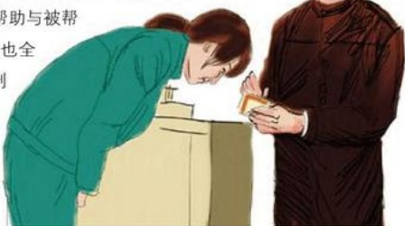

# 相逢是首爱的歌

作者：新乡/和城丽

在我的记忆里，有许多令我感动的事，但是最令我难忘的还是发生在去年冬天的那件事。我是一名收银员，工作时注意力要高度集中，每天不仅要用心微笑对待每一位顾客，而且还要熟练、快捷、准确、认真地收钱，所以每天在临近工作时间我就会把心情调整到最佳状态，因为万事心情造。

一天中午，一位先生交款，他看着很有绅士风度，着装大方，但是表情很严肃。在付款时，我听他口音不像是本地人，有点像南方人。他从包里掏出银行卡递给我，我刷过卡收了单，直接把票交给了这位顾客，并微笑送走了他。到财务去结算时，我竞发现钱少500元，少钱需要自己贴的，而500元将近半个月的生活费，我此时的心情像外面的天气一样阴而冷。那天傍晚非常寒冷，北风呼呼刮着，鹅毛大雪从天空飘落下来，地上已开始有积雪，我的心情沉重。这时，我看到一张似曾见过的面孔，头顶上还有未化的雪花的男人站在了我的面前。他说下午办事用卡时，发现卡上多了500元，想想一定是在买衣服时刷错了。把银联存根拿出来一看是98元，他买的明明是598元的衣服。说着就把银行卡给我，我仔细核对了一遍，确实是598元刷成了98元。大哥说：“你上班也不容易，哪能让你为我买单，本来想明天送来，但是这次出差事情办得顺利，提早可以回去，明天早上就要坐火车回去，所以趁与客户吃饭之时给你送来。”当时，我真的很感动，他冒着大雪迎着寒冷来

给我送卡。我感动的当时也不知说什么好，就只能一直说谢谢。他说，以前出差来过胖东来，说这里不仅服务好，他买东西时包丢了，里面装着比现在还重要的东西，最后在最短的时间里失而复得，多亏胖东来。

人与人之间一直都是互动关系，帮助与

助，感动与被感动，这位大哥的行为也全

靠我们平时的良好信誉和服务态度得到

回报。他们给了我们帮助，我们更应

该用爱感动所有的人，用爱赶走寒

冷，用爱去收获心灵，让心灵去感动

心灵。

## 我们店的送货故事
