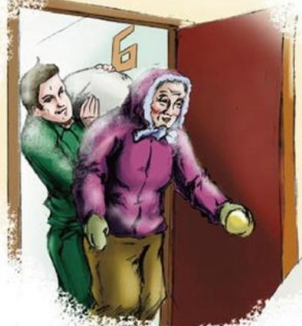

# 我们店的送货故事

作者：超市部/李雁冰

临近春节的时候，天降大雪，非常寒冷。有一位大娘买了一袋25公斤的面粉，问我们能不能送货，正在南门值班的保安郑彦强说道：“当然可以，大娘，我给您送。”大娘家离我们店不远，就在东风小区院内。不过路上积雪很厚，在湿滑的道路上推着25公斤的面粉走得很艰难。送到了楼下，大娘说：“我家住在六楼顶层，你给我扛上去吧。”楼道狭窄，楼梯台阶又陡，六层楼，百余层台阶。郑彦强一股劲把面粉扛到大娘的屋门前。虽是寒冬腊月天，他却累得满头大汗。大娘打开门后说：“哟，真不巧，我女儿已经买了面粉，你送来这袋我不要了。”郑彦强微笑着说：“没事，我们给您退，我再扛回去。”大娘又说：“天这么冷，我也一把年纪了，不想再出去了。”郑彦强笑着说：“我替您办退货手续吧，办完把钱给您送来。”郑彦强又把面粉从六楼扛到一楼，推回店里。办好退货手续，他再次顶着刺骨的风雪把52元钱送到了大娘家中。大娘激动地说：“小伙子，你的服务可真好，坐下喝杯热茶再走吧。”郑彦强摆摆手说：“大娘，别客气，这是我们应该做的，我还得回去上班，再见！”后来大家慢慢知道了这件事，有人不理解问郑彦强：“她买咱的面粉，大冷的天，咱送去她又不要了，退货自己又不来拿钱，咱一分钱没赚又赔上那么多时间和力气，值吗？”郑彦强说：“这次她没买我们的东西，可下次呢？以后呢？只要我们把服务和各方面工作都做好，顾客就一定会来而且常来。不管顾客有什么要求，我们的职责就是让每一位顾客满意！不能用顾客给我们带来多少利润来衡量服务的标准。”他的话，让我们领悟到了服务的真谛。

## 雷锋服务队的故事

