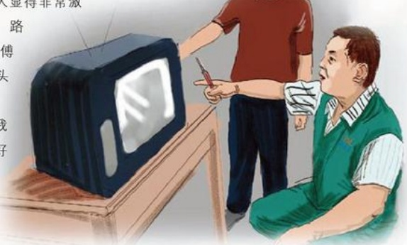

# 雷锋服务队的故事

作者：电器售后/侯春得

那是2006年的盛夏，我们胖东来学雷锋小组到一个乡村组织义务维修家电。刚开始时，村民们比较好奇，有的问这，有的问那，渐渐地聚起了人群，陆续开始有人登记，排队接受服务。

下午时分，有一个六七十岁的老汉慢慢走过来，试探着问，修电视机么？我说修。他说黑白的，我说行啊！他猛一高兴“那走吧，我家离这不远”。我就背起工具包跟在后面，他家挺不好走，曲曲拐拐终于到了，院落虽显得贫穷但很干净。在屋里，我看到了一台陈旧的14英寸黑白电视，试了一下机，感觉毛病不小，拆开检查。老人说他找了好几个修家电的，别人一听说是黑白机就不修了，更别说上门了，你们真好，我终于查到了损坏的零件，但我估计配件由于太老，不太好找，于是我把这些情况告诉老人，老人也有些为难，叹着气说：“人老了，机器也老了，要是手头宽裕呀，早换新机器了。”我看着老人期望的眼神，心想：不能让老人失望啊！就打电话到公司，请求帮忙，买配件大概等了一个多小时，一位同事大汗淋漓地跑来，把配件带过来了，我一看不太一样，但改动一下电路还能用。就又费了一番功夫，等到电视机出现清晰的画面时，我和老人都会心地笑了，一切都收拾好，老人问多少钱时，我对他说免费，他猛一愣，那怎么行啊，一定得给

呀！我坚持免费，老人显得非常激动，临走送了我老远，路上逢人就夸胖东来师傅手艺好，还照顾我老头子，真好啊！

每当回忆此事，我都在想：我会一直好好干下去！

## 破碎之后
