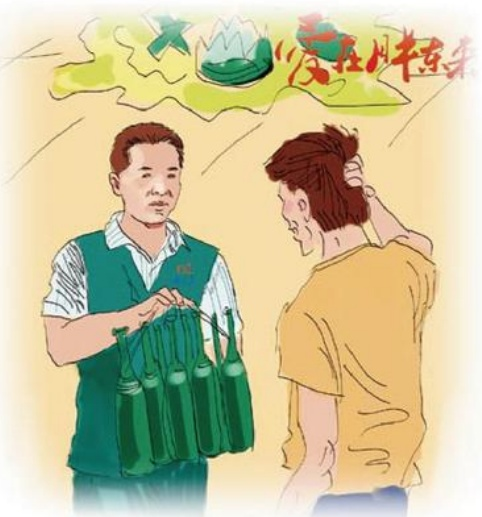

# 破碎之后

作者：超市部/何吉红

有一天傍晚，有几个年轻人抱着一件啤酒（自带的）来我们店购物，由于几个人边走边说笑，在快要到卖场入口时，啤酒不小心脱手掉在了地上，顿时啤酒洒了一地，四处漫流。几个人一时不知怎么办才好，我们的保安急忙上前询问：“怎么样，伤着没有，这里你们不用管了，进卖场吧，我们来收拾。”几个人连声说谢谢，又说对不起（大概他们觉的给我们添了麻烦），踮着脚尖，小心翼翼地离开“危险地”进入卖场。

前厅员工及临近进口的

洗化区促销都闻声赶过来，见状急忙拿来卫生工具清理地面，顾客没伤着进卖场了，地面也已清理干净，按理事情本应该结束了，可偏偏却发生了奇妙的变化。店长正在巡场，闻声过来时，见我们收拾啤酒碎片，问明情况后，又对我们烟柜员工说：“等他们几个人从卖场出来时，把我们的啤酒送给他们一件。”我们虽然答应了，但心里有些不舍，又不是买我们的啤酒，干嘛要赔他们。在这几位年轻人出卖场准备离开时，我们把啤酒送给了他们，他们觉得很意外，说什么也不要，对我们的做法也有些不解。我们告诉他们说：“收下吧，没关系的，你们进店就是我们的顾客，开心购物胖东来，啤酒打了只是意外，再送给你们一件，希望你们每次来胖东来购物都是开心的，这是我们应该做的。”几个人翘起大拇指，欣然接受了，抱着啤酒高兴地走了。

## 推车
