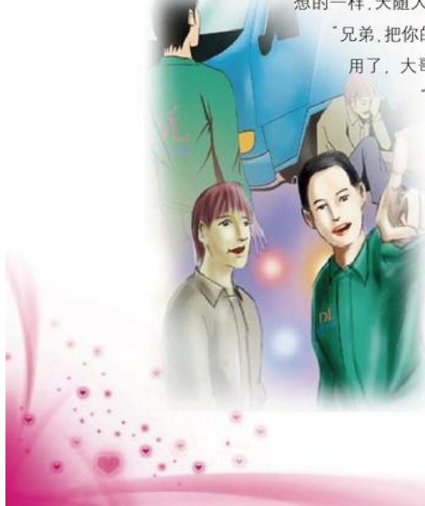

## 推车

作者：新乡百货/崔世选

“兄弟过来一下吧，别走……别走呗……”那天中午下班，我骑着自行车顶着烈日急忙往家赶，因为早上没吃饭，肚子叽里咕噜叫个不停，当我走到胜利桥时，有一位大哥叫住了我：“兄弟过来一下吧！帮忙推下车！”这时我才发现，路边停了一辆旧面包车，当我下车来到面包车旁，那位大哥忙掏出烟让我，嘴里还说着：“车有点破，走到这儿突然就熄火了，大热天的中午，刚才我喊了几个人，可都没人帮我，真不好意思叫住了你……来，先把烟点着！”我忙说：“不用，不用，我看咱俩先想办法把车子打着才是急事，吸烟不急。”大哥听了我的话十分感动：“兄弟有你这话，大哥我也不客气了，说干就干。”说着话，我们俩就把车子推到了一个上坡处，趁着下坡省劲儿。“开始吧！”大哥坐在车子里，我在后面推。一次，两次，三次，当要重推第四次的时候，我已经满身大汗，衣服早已被汗浸湿贴在身上，真有点后悔当初答应他了。大哥看我累得满身大汗，就下车跑到我跟前，不好意思地说：“兄弟，如果不行你也别推了，我打个电话，叫人把车子拉走吧！”我也不好意思地说：“再推一次吧！已经推了三次，估计这回一推，车子就发动了。”这次正如我们想的一样，天随人意，车子终于发动了。大哥跳下车跑到后面对我喊着：“兄弟，把你的自行车放到车上，咱俩去吃饭。”我骑上车说：“不用了，大哥，家里人还等着我呢！”大哥又叫住我，问：

“你叫啥名，在哪上班呀？”

“胖东来！”

“好兄弟，我一定去胖东来找你。”我骑着车子走了老远，回头看，发现那位大哥还在路旁看着我。

这事发生有一段时间了，在这当中，那位大哥到商场来过好几次，每一次看见我，大老远就喊：“兄弟，我来了。”

一件小事就能反映一个人的品德，如果那天不是我遇到了这事，而是其他兄弟姐妹，相信他们也会伸出援手的。

## 弄洒的爆米花
