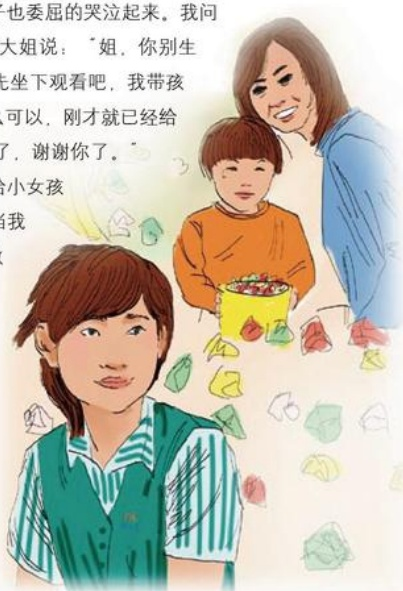

# 弄洒的爆米花

作者：新乡电影厅/尚月娥

有一次，有一个年轻母亲带着一个六七岁的小女孩来看电影，电影开场前母亲带着孩子来买爆米花，我们的营业员给她装了满满一桶。当她们转身离去时，拿在孩子手中的米花筒不小心掉到了地上，米花撒了一地，这位母亲责备孩子怎么这么不小心，刚买的就弄湿了。我们营业员看见了忙对大姐说：“大姐，没有关系的，我再给您盛满吧！”大姐听后不好意思地说：“您谢了，是我孩子不小心弄洒了，你们还给我们免费添。”入场时间到了，该我为大姐服务了，检过这位大姐的电影票后，我借助手电的光亮将大姐和孩子送到她们的座位上。可是由于光线比较暗，孩子没有踩稳厅内的台阶，一不小心手中的爆米花又洒了。这时她妈妈看到后，生气的责骂到：“你怎么这么笨，一会功夫弄洒了两次，我不管你了，爱看不看。”孩子也委屈得哭泣起来。我问过大姐得知孩子刚才弄洒了爆米花，就安慰大姐说：“姐，你别生气，主要是我们厅里比较暗，不怪孩子，你先坐下观看吧，我带孩子去再盛些爆米花吧。”大姐答道：“这怎么可以，刚才就已经给我们装满了，爆米花也是有本钱的呀，不用了，谢谢你了。”

我笑着带孩子出来，给领导说明情况后，又给小女孩装满了满满一桶爆米花，小女孩开心地笑了。当我把孩子送到这位大姐身边时，大姐对我感激不尽，满脸歉意连连说道：“你们胖东来的服务就是好啊，爆米花洒了是我们自己的责任，可是你们两次都免费给我们盛满，等于我花了五块钱买了三桶爆米花，真的很谢谢你们啊！”

看着这对母女脸上的微笑，我们也感到很欣慰。就是这样的一桶爆米花，说实话值不了几个钱，可是却换来了顾客的满意和开心，我认为真的很值！

## 今夜的星空真美
