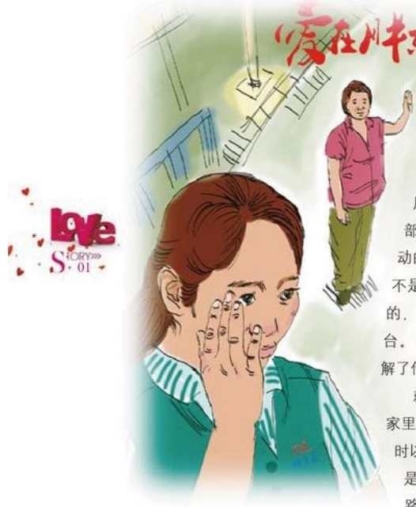

# 今夜的星空真美

作者：电器部/闫玲云

一个炎热的晚上，柜台前来了

一个三口之家，我微笑着打了个招呼，

这时顾客说：“我们不买，只是借星期

天来逛逛。”但一句逛逛并没有打消我的

热情，通过与顾客的交谈，我了解到顾客家

原有的电磁炉不知什么原因时好时坏，听了以

后，我耐心详细地的给他们介绍了电磁炉的使

用，保养及维修，之后又建议他们可以拿到售后

部给检修一下，就可以正常使用了，顾客听了很激

动的说：“谢谢你，真为我们着想，我很高兴你们

不是极力推荐自己的产品而是讲解，建议，不为别

的，就冲一个能让我们节约、实用，我们决定再买一

台。”不经意间，成交了一笔销售，那一刻我真正了

解了什么是真心，什么是服务。

就在这时，顾客大姐提出能不能帮我们把货送到家里，大姐住址是医学院，离商场约10多里，当说这话时以征求的目光看着我，我有点犹豫了，因为小家电是不送货的，更何况天太晚了，马上就要下班了，路又远，还得自己搭上车费，回来晚了甚至连公交都赶不上，但转念一想，我们的职责就是让每位顾客满意，想到这里，我满脸微笑着爽快地答应了。当大姐强烈要求把我送到四路车上的那一刻那，我也深深的被感动了，天越来越黑了，公交车越走越远了，马路边的顾客大姐也越来越模糊了，但我仍依稀看到大姐还在给我招手，对我微笑，用手去触摸脸，发现脸上湿漉漉的，此时的我明白了很多，当你用一颗真诚的心去对待你身边的每一个人和发生的每一件事时，你同样会收获很多……今晚的星空真美！

## 爱在胖东来
