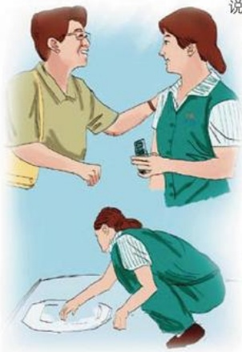

# 爱在胖东来

作者：新乡百货/李梦姣

我是胖东来的一名促销员，在这里上班的半年时间里，不断地感受到来自这个大家庭的温暖，店里的员工对待顾客更是无微不至，我也经常看到周围发生的那些感人的事，虽然不是什么惊天动地的大事，但正是这些小事，体现了胖东来人的热情、真诚。

有一次去厕所，刚推开门，就看到乱哄哄的好多人挤了一大群，还听到有人说：“肯定捡不出来了。”立刻有人附和道：“是啊，这怎么带啊。”听到她们讨论我才知道，原来有位顾客不小心把手机掉进便池里了，负责打扫厕所卫生的保洁员阿姨正在帮她捞手机。保洁姨手里拿着一个铁丝弯成的小钩慢慢地探试，只听到金属碰撞发出的声音，似乎是手机链在响，可就是不见手机被钩上来。手机的主人在旁边很着急，保洁姨突然做了一件大家都没想到的事，她丢掉手中的铁钩，蹲下身子用手捞！或许是她的动作惊呆了所有人，大家都停止了议论看着她，我们都看到了保洁姨额头上滴下的汗水……过了两三分钟，突然看到保洁姨脸上露出了一点笑脸，“可能捞到了吧。”人群中有人说。果然，保洁姨伸出手直起身子，手里握着一部手机，那部手机已经有点旧了，可对他的主要来说，它很重要。手机的主人千恩万谢，说了好多话，可那位保洁姨一副平静的样子，静静地

说：“快看看坏了没，还能不能用了，下次注意一点。”

话虽不多，但字字朴实，没有一点点张扬或得意。

旁边围观的人又开始讨论了，有人夸赞，也有人鄙夷，说那么脏竟然用手捞，但立刻招来了所有人的谴责，等她们议论完，回过身，那位保洁姨已经离开去清理别处了。我顿时对这位保洁姨心生敬佩，不怕脏，不怕累，一心只为方便顾客，这不正是胖东来人的风格么？

这样的事在胖东来时刻都在上演，也正是这样一件件小事，体现出了胖东来人的乐于奉献精神，又因为胖东来有一群这样乐于奉献的人，才使顾客朋友真正感受到“爱在胖东来！”

珍藏在我内心深处的感动

