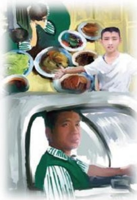

# 珍藏在我内心深处的感动

作者：电器部/燕晓峰

2001年4月25日一大早，一位驻马店确山县的顾客在音响区购买了一套家庭影院。这是自胖东来电器量贩开业以来我们销售最远的用户。得到商场经理同意后，我们决定给他送货上门安装。顾客说在车站量贩还购买了很多商品要求一起送。商场很快从外销部调来一辆依维柯，到量贩装了满满一车：日常生活用品、柴米油盐、花草盆景，甚至还有活蹦乱跳的小鸡仔，和顾客一家三口我们浩浩荡荡出发了。

顾客的家位于确山县蚁蜂镇的一个小山村里，说实话这路真不近，光高低不平的山路就走一个多小时。终于到了用户家，我和司机很快卸完了一车货，女主人忙着做饭去了。我开始安装音响。正常情况下二三十分钟就能搞定。因为音响线的原因，反复调试了近一个小时才弄好。这时顾客家里已经做好了饭菜，满满的一桌。男主人非要拉着吃饭，我给他讲解注意事项。他说他的习惯是先吃饭再干活，我说我的习惯是干完活再吃饭，就这样我们反复推辞着，我一直坚持。他甚至有点生气：“我当了八年的兵，在部队我是连长，谁不知道我是出了名的倔脾气，你难道比我还倔？八路军当年不拿群众一针一线，你们胖东来人比八路军的纪律还严吗？干到哪儿吃到哪儿，一顿普通的家常便饭，怎么算是违反纪律？况且附近没有饭店，出去吃饭最近的镇离这儿一个钟头的山路，今天不吃饭你就走不了！”

当时已是下午三点左右，从早上上班还没吃早饭直到现在，说心里话早就饿过头了。站在院子里，看着用户全家人那真诚甚至有些近似乞求的目光，我真的有点动摇了：要不吃这顿饭，完了给用户钱？毕竟这种情况特殊，我这样想。可是用户到时候肯定不会接饭钱，又很麻烦。坚持，越是远的客户，越是特殊情况，我更要坚守公司理念。主意已定我坚持要走，顾客全家人拉住不放，拉扯中我上衣的扣子还弄掉了一个。我还没有走到门口时，顾客家的小孩儿冲到大门口，迅速反馈的大门：“叔叔，我不让你走，你得吃俺家的

## 从《非诚勿扰》谈服务
