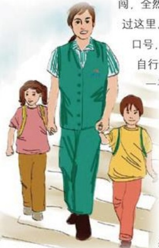

## 爱的色彩

作者：配送中心/曹松强

“创造财富，播撒文明，分享快乐。”这是我们的愿景。每一位胖东来人在创造物质财富的同时，也正在用自己的爱心和行动播撒着文明。

发生在9月上旬的一件事，一个美丽的感人场景，将永远定格在我的脑海里，让我时时感动，永久难忘。

那天下午，正是下班的高峰期，路上的行人及车辆特别多，当我走到劳动路与建安大道交叉口的时候，一群群放学的孩子也陆续汇集到了这里，人与车辆开始“短兵相接”，穿插而行，危险系数骤然增加。特别是需要穿过马路回家的学生，更是心急如焚，横冲直闯，全然不计后果。这时，一位身着胖东来工装的女员工，也正好路过这里。她忽然看到身边有两个小男孩，两个手拉着手，嘴里喊着口号，正准备用劲往对面冲。“站住！”她大喊一声，接着快速将自行车放在路边，走到那两个正木然看着她的两个小男孩身边，手拉起一个，开始慢慢往对面走。当她把两个小男孩安全送到马路对面时，又发现一个已经走到马路中间的小女孩。这时，小女孩正焦急地看着川流不息的车辆，不敢前行，吓得抹起了眼泪。女员工向小女孩靠近，并用手示意前行的车辆停止。一位出租车司机将车停了下来，并从车厢里伸出头微笑着说：“过吧，不要着急。”女员工感激地向司机师傅点了点头，然后又快速把小女孩带到了安全地带，她身后留下的是一声声“谢谢胖东来阿姨，谢谢胖东来阿姨”悦耳动听的感激声。

人间最美是善良。这短暂一瞬间，也许是很平常的一幕，那天经过这里的很多人也许都不会太在意。可我想：那两个小男孩和那个小女孩肯定忘不了，那位第一个停下来的出租车司机也肯定忘不了。他们不知道那位女员工姓什么叫什么，可他们一定知道那是一名胖东来人，一名播撒文明，具有浓浓爱心的胖东来人！

愿我们的每一位兄弟姐妹都能像那位不知道姓名的女员工学习，都能成为传播文明的爱心使者。

## 难忘的日子
