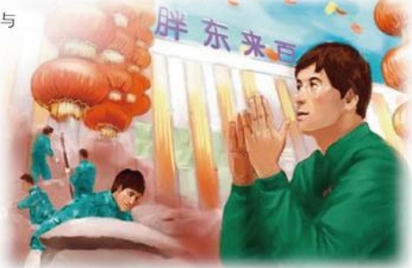

# 难忘的日子

作者：超市部/王军奇

我是2005年的员工，曾参加了新乡胖东来百货的建设，那段时间让我永远难以忘怀。初到新乡，我们便投入了紧张的工作中，因为当时楼盘尚未完工，又加上开业时间紧迫，楼道里保安一袋一袋地搬运沙子、石子、水泥，员工一箱箱地搬运建筑垃圾，每个人的脸上都淌着汗水，我们都穿着清一色的迷彩服。一旦有人需要帮助，马上有穿迷彩服的兄弟姐妹赶来，虽然彼此并不熟悉，但一声“大哥，大姐”的称呼却不经意间拉近了人与人之间的距离，让人有一种说不出的亲切感。

楼层里面光线较暗，所以无论白天黑夜都亮着灯，一进入楼内，就投入了繁忙的工作，连吃饭也在负一楼，所以我们简直分不清白天黑夜。因为工期短，几乎每天我们都加班加点地工作，每个人的脸上都带着一丝疲倦，眼睛因睡眠不足红丝满布，但却听不到一声怨言，大家都在默默工作着，为我们自己的新家忙碌着，心中都有一种信念在支撑着，我们忙并快乐着。我们的辛勤劳动终于有了回报，12月22日胖东来百货开业了。开业前夕，我们虽然已经奋战了几天几夜，但开业那天早上我们在大厅里挂灯笼时，都没有一丝倦意。中午当我看着万人涌动的热闹场景，不知怎么地泪水从我脸上滑落下来。当时不知是兴奋，激动，还是感慨，现在我已经无法用语言去描述当时复杂的心情。

兄弟姐妹们，胖东来百货的每一个角落，每一寸土地都浸透着我们的汗水，那是我们自己亲手建设的家园。我们用最短的时间创造了一个商业建设的奇迹，她有我们太多的感情投入，也有太多的幸福和快乐。我们每一名员工只有亲身经历那种场面，才会真正与企业建立深厚的感情，才能与企业共生存、共发展、共壮大。就像东来哥说的那样：“用10年时间把我们的企业打造成世界最优秀的企业。”我们一定能够做到的，因为每一位胖东来员工都是那样深深热爱我们的家园！

## 小偷的信任
