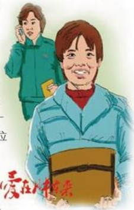

# 小偷的信任

作者：服饰部/姜凤婷

去年10月的一天晚上，在东区2号收银台，梦特娇皮具专柜的营业员将一个皮包交到收银台，说有可能是顾客遗失的。大家打开包一看，里面一分现金没有，但失主的身份证、医疗卡、电话本等重要物品却放在里面，原来是小偷偷的包。怎么办呢？如果告诉失主，她又会怎么想呢？我们真有些为难。

这时止好我们的王管秋姐来了，听元情况后，她用自己的手机按电话本上的号码一个一个打，但很多都说不认识失主，后来有一个号码，是失主家里的，秋姐便向他说明了情况。第二天一早，一位中年大姐便来到收银台问包，在核对无误后，收银员将包还给了她。失主激动地说：“我的包是在批发市场丢的啊，小偷还真聪明，也算有良心，把包丢在胖东来，看来胖东来就是值得信任！”听完这些话我的内心不知道该是高兴还是难受，我希望这个世界多些关爱，多些正义，多些和谐那该多好啊！

## 心灵销售

作者：广场营销部/苗晓娟

前一段时间，我们区来了一对父子。男孩个子瘦高，十七八岁的样子，穿得很讲究，而他的父亲穿的很朴素，衣服和裤子还有一些破。

我介绍的款式男孩相不中，他父亲挑的也相不中，最后他相中了一款218元的夹克，他的父亲很尴尬，从兜里掏出了160元钱，说就拿了280元钱，刚买了一条裤子120元。他对儿子说：“娃，要不咱再挑个吧！”儿子坚持说：“不，别的不要。”然后就扭头站在了一边。

从父亲的话中，我了解到他们家就这一个独子，要什么给什么，从来没有说过不，脾气还很大。

我就过去和他聊，聊我的爸爸，如何的坚决让我独立，我的眼泪和辛酸，与他的父亲对他有多好来比较。他的眼神变了，自己找了一款和原先款式相似价格148元的上衣，试穿后很高兴的接受了。

我想他父亲会很高兴儿子的变化，更会满意我们的服务。

## 由小事想到的
