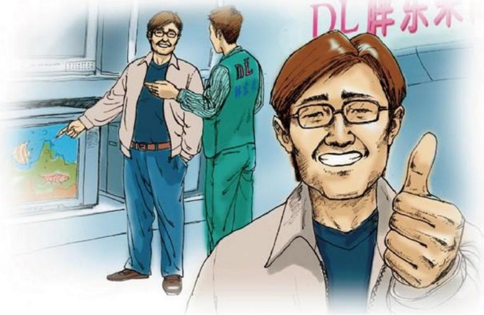

# 由小事想到的

作者：新乡/赵爱利

小唐是我一个旧同事，前一段她家的电视机被她淘气的儿子不小心推到地上，当时就图像，声音全无。去一家家电器维修部看了看，维修费要一百元多，小唐就问我有没有熟人会修电视，我就告诉她胖东来电器售后电话。几天后，小唐兴高彩烈地告诉我电视修好了，洗衣机修好了，热水器修好了，没花一分钱，把我弄得懵懵的。原来胖东来售后到她家一检查电视，是电视里面的线路摔断了，焊接了一下就修好了。小唐问多少钱，售后工作人员说不收费。小唐真是有点不相信，第二天，她又打售后电话，说她们家洗衣机脱水缸坏了，售后去了又免费修好了。第三天，她又打售后电话，说她们家热水器不打火了，售后去了又免费修好了。小唐现在是胖东来的忠实顾客加义务宣传员，他无论到那里都说胖东来是“雷锋之家”。我听到之后总是欣慰的微笑，同时对企业也充满了深深的感恩与爱。

## “小红鱼”的故事
