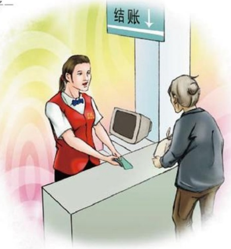

# “小红鱼”的故事

作者：新乡广场/丁燕

那天早上刚迎完宾，一位老大娘手提着一棵包菜和一块豆腐步履蹒跚地走向了我的款台。我急忙弯腰接住了她的东西，扫完价后说：“大娘，您好！一共两块四毛。”她边说“好”边往口袋里掏钱。只见她颤巍巍地从怀里掏出了一个纸包，里面有几张皱巴巴的一块和一张“小红鱼”一百。我心里祈祷着她给我一块的，别给我那个“小红鱼”，因为我现在零钱很少。

“闺女，给你一百！”只见她用手展了几次那张“小红鱼”才递给我。

“大娘，您有零钱吗？”我轻声问。

她窘迫地看了看我，欲收回她的一百元，嘴里喃喃地说：“闺女，这一百元我在哪儿都不敢花，怕找给我假钱，只有在这儿我才放心啊！”听到这话，我突然鼻子一酸，天哪，我差点犯了个大错！于是我什么也没说，快速地找给了她一把崭新的零钱，大娘一个劲地谢我，但我觉得很惭愧。

通过这件事，我觉得自己所肩负的责任不小，每一个胖东来人都代表我们的公司，老百姓这么信任我们，我们更要加倍地努力，让他们失望。

## 从批评关空调说起
