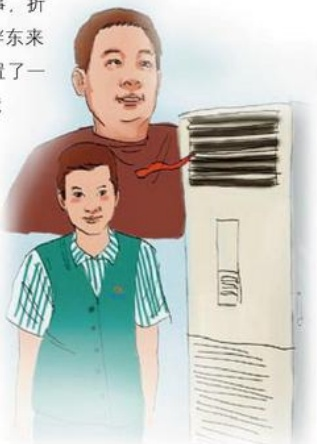

# 从批评关空调说起

作者：顾客/娄红亚

胖东来早已成为许昌人的明星和骄傲，得到了广大消费者的认可和爱戴，短短十几年时间，胖东来白手起家，从小到大、从弱到强，走过了一条不平凡的成功之路，是什么成就了胖东来，从于东来的一次批评可以从一个侧面来解读胖东来的成长壮大。

多年以前，由于工作原因，我到胖东来办事，在等候的时候，看到一张好像叫“胖东来人”的宣传页，上面有一篇于东来在公司中层管理人员会议上的讲话，讲的是，当时是夏季，天气炎热，上午开门营业不久，于东来到市区某店察看，发现该店没开空调，于东来就问店长，为什么不开空调，店长回答说，刚开门顾客不多。看到这，我想节约用电这位店长一定会受到表扬，但是于东来却批评了该店长。在这次的中层大会上，于东来重提此事，于东来讲，顾客不多，那我们的员工不都在岗位吗？顾客怕热，我们的员工就不怕热吗？于东来讲，我们既要把顾客当上帝，还要善待自己的员工如兄弟，要搞好员工的降温降暑等福利。由此不由人联想到市区的某些企业，高管纷纷跳槽，员工人心思离，最后关门大吉。在当今经济利益至上的社会，企业无不以追求利润最大化为目标，从于东来批评店长不开空调这件小事，折射出的是胖东来以人为本的理念和做事做人的理念。胖东来不仅为顾客创造了一个温馨的购物天堂，也给员工安置了一个温暖的工作之家。为什么胖东来能在残酷、激烈的竞争中发展壮大，与每个胖东来人的齐心协力是分不开的，再好再高明的营销策略都是靠一个个人去完美实现的，这件事这么多年来我不止一次地讲给我周围的人和接触过的、熟悉和不熟悉的一些大小老板们听。

“视顾客为上帝，视员工为兄弟。”如果每个领导和单位都能像胖东来人这样善待他人及部署，这个集体一定会是一个最有凝聚力、最有战斗力、最具活力的团队，也一定能不断地创造出更辉煌的业绩。

最后祝愿胖东来的明天更好！

## 回报
