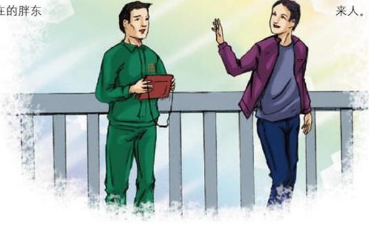

## 回报

作者：新乡百货/崔天伟

盘存前一天，我正在仓库抄盘存表，有人叫我，一看原来是我妻子，只见她满头大汗，一脸很着急的样子，我赶紧问她怎么了？她说她的包丢了。我一听，心里咯噔一下，那里面有我们的存折、手机、身份证、工作证，哪一样都很重要呀！但我还是安慰她说没事，别着急，我们把存折挂失就行了，其他的再想办法吧！过了两天，下班时，妻子对我说：“下午有人把工作证送来了，还留了电话号码。”我一听，这小偷未免也太嚣张了，是不是存折里的钱取不出来？想让我出钱把东西换回来。第二天一早，我按对方留的号码打过去，接电话的是一位男子，我们约定在桥头小学见面。到那儿时，他已经在等着了，我已经做好了应付各种条件的心理准备，走上前去说：“大哥，太谢谢你了，真是个好人哪！”他说：“你说说包里都有什么东西？”我说了之后，他点点头：“嗯，先把东西拿去吧？”我一听，赶忙把烟递上去，他说什么也不要，竟然说了一句我怎么也想不到的话：“你们胖东来那么多拾金不昧的人，不也是这样吗？我是你们的忠实顾客，也曾经在你们那里丢过东西，当天就有人给送了过来，从这一点可以看出胖东来人的素质是不错的，我希望你们能越干越好，把你们的文明播撒在新乡这块土地上，让更多的人文明起来。”接过包，我感慨万千，同时感觉到做为胖东来人责任的重大，我们真的做到让每位顾客满意了呢？是不是每个胖东来人都在为我们的品牌增辉呢？还没有，我们的距离还很远，我们今后更要一步一个脚印走下去，做一个实实在在的胖东来人。

## 用心才会快乐
