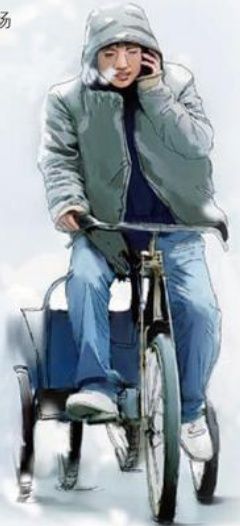

# 坎坷经历成就财富

作者：许昌市教育局/肖万君

读《东来致顾客的一封信》随想之一

编者按：2月5日，《东来致顾客的一封信》在本报发表后，在社会上和读者中引起了强烈的反响，大家都为于东来的坦诚而感动，胖东来一时又成为市民和读者议论的话题。读者肖万君给编辑部写来了他对这封信的看法，相信这也代表了广大读者的心声。为此，本报特意将肖万君的文章发表，以飨读者。

没有见过胖东来的老总于东来，但每次走进胖东来生活广场购物时，看到富丽堂皇的楼台设计、琳琅满目的商品、熙熙攘攘的顾客、红红火火的生意……心想，胖东来的老总一定是一位不同凡响的人物。

是，读了于东来写的《东来致顾客的一封信》，了解了他的

经历，我感到大出所料，这位拥有2000多名员工的大商场领军人物，竟然也是个平凡之人。他同样有着坎坷的经历，品尝过人生的酸甜苦辣。在青少年时期，他辍了学，摆过小摊儿，卖过冰棍、瓜子、西瓜。他下乡转悠卖冰棍儿，一天骑车来回百余里；他也路过三轮车，日夜奔波为人送花；他还四处奔波打过工，临时帮人干活。不仅如此，他在做小买卖时，既受过骗，上过当，也违法，蹲过牢……最终欠下十几万元的债。他的日子过的够艰辛、苦涩了，走过的路够坎坷，崎岖了，实在是连一般人的运气都不如。

可贵的是，这艰辛，这苦涩的经历没有磨掉他的志气，这坎坷，崎岖的路没有把他压趴下。相反，他走一步，总结一次，吃一堑，长一

