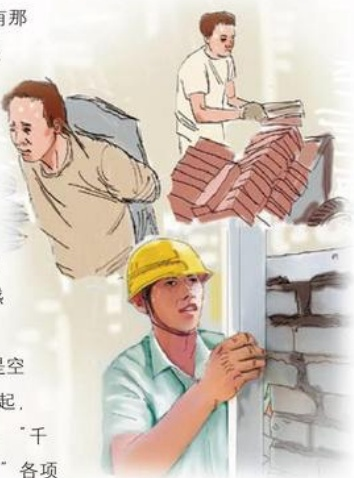

智，从一时的失败中吸取教训，从艰难中感悟人生，学会做人，从而把坎坷的经历变成贵的财富，变成重新再干的铺路石。辍学使他少学了课堂上的许多东西，但坎坷的经历也是一所学校，使他在社会实践中学到了许多课堂上学不到的东西。

宝剑锋从磨砺出，梅花香自苦寒来。于东来把坎坷的经历变成财富，在艰难和贫寒中磨砺了意志，学会了做人，学会了经商。经历磨难好做人，他从艰难坎坷中获得的这笔财富，不正是他重新振作、起步再干的最宝贵、最靠得住的精神力量吗？

## 再不梦想“天上掉馅饼” ----读《东来致顾客的一封信》随想之二

于东来曾问自己：“刚开始走的路，为什么有那么多挫折，坎坷？”他深思后的回答是：“不是因为命运不好，而是自己太急于发财，太急功近利，总盼着天上掉下馅儿饼。”后经反思，他悟出了一个道理：“无论什么事情，都应当脚踏实地，一点一滴去做。”他多次告诫员工们，“天上不会掉下馅儿饼”，“不是自己的坚决不要”，如果天上掉下了馅儿饼，那一定是“陷阱”。这是多么家常、实际而又发人深思的感悟啊！

做生意，谁不想做大、做强？但这大和强不是空想来的，也不是一蹴而就的，而是从一点一滴做起，一步一个脚印，日积月累实干出来的。古语道：“千里之行，始于足下。”“九层之台，起于垒土。”各项事业的成绩都是干出来的，靠说是不会出成绩的。群众曾给那些只说空话的人送过一副对联，上联是“你讲话，他讲话，人人讲话”，横批是“谁来落实”。道理很明白，做与说相比，做更重要。因为做是说的目的，说必须通过做来实现。

聚沙成塔，聚腋成裘。从一点一滴做起，这“一点”、“一滴”积累到一定程度，事物会发生质的变化。
