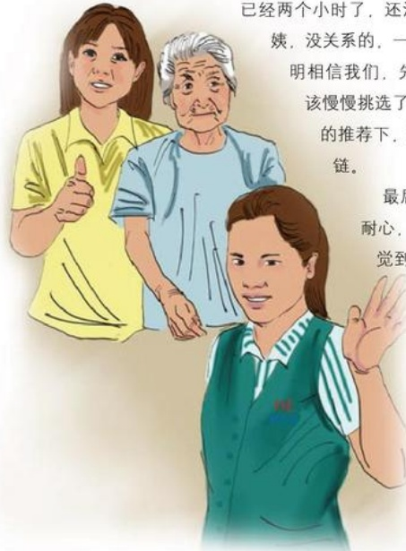

# 无声的爱

作者：新乡百货/苏文娟

喂，服务员，你们的黄金多少钱一克？”一位60多岁的大妈带着一个30多岁的大姐来到柜台前面。我马上放下手中的抹布跑过来，笑着说：“您看喜欢哪一款，我给您拿，是大姐您戴还是阿姨戴的呀？”这个时候阿姨的脸上显出不明的意思，那位大姐一直看着项链，一声不吭，好像听不见我说话。阿姨说：“姑娘你大声一点，我是一个聋人，她是我女儿，是一个哑巴！今天给她买项链。”这么一说我全明白了。

我立即从柜台里面拿出来本和笔，以文字形式与她沟通，我问她想要什么款式的项链，是美装链，还是竹节链，她接过笔在本上写着竹节。她来来回回试了有十几条项链，我不停地将项链拿出，并以文字形式告诉她每条项链的特点。这个时候阿姨说：“你看，已经两个小时了，还没有选好，麻烦你了。”我说：“阿姨，没关系的，一点不麻烦，既然你来胖东来消费，说明相信我们，先喝瓶水，这么贵重的东西，当然应该慢慢挑选了，我来帮她选一条。”最后大姐在我的推荐下，买了一条价格，款式都十分满意的项链。

最后，那位大姐在本上写着：“你真有耐心，不厌其烦地给我拿商品试戴，让我感觉到在胖东来就像在自己的家一样温馨，谢谢你！我在其他商场消费时，还没问几句话，营业员就爱理不理了，因为我是一个哑巴，一个残疾人，但是在胖东来让我感觉不一样。”

这件事使我更加明白只有真心，耐心对待顾客，只有做到为顾客服务时像对待自己的亲人一样，想顾客所想，我们才能赢得顾客的心，为我们的品牌添光添彩！

## 用我们的爱心净化一片天
