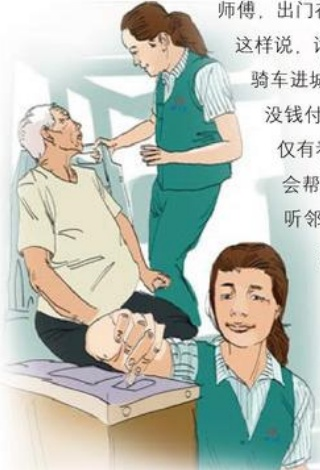

# 用我们的爱心净化一片天

作者：超市部/纽倩楠

因工作的地方离家较远，再加上这几天天气寒冷，已经有好些天没回家了，归心似箭的我急急忙忙换了把零钱，登上了回家的公交车。

公交车上的乘客不算太多，我拣了个靠窗子的座位坐下。“市交警支队到了，请下车的乘客携带好随身物品下车……”，车子缓缓地停下。车门打开了，前门上来一位老大爷，想对司机说些什么，却又欲言又止。司机说：“怎么不投币？如果没有，就下车，别耽误大家的事！”“师傅，让我搭一下车吧，我车丢了，回不了家。”老大爷恳求道。看着老大爷可怜巴巴的样子，几位乘客也帮腔道：“师傅，让他搭一回吧，出门在外谁没有个难处啊！”司机很不乐意，但也没有赶他下去，然而却说了一句：“记着下回搭飞机。”一句羞辱的话，让老大爷羞红了耳根，愣在了那里。大家都很气愤，但都敢怒不敢言，我站起来把老大爷扶到座位上，又向投币箱里投了一元钱。“这一元钱我帮大爷掏！师傅，出门在外谁没个难处呀，谁没个父母，他这么大岁数了，你

这样说，话有点重了。”经过询问，我了解到老大爷是尚集的，骑车进城买药，出来车子就不见了，身上的钱都买了药，所以没钱付车费。我告诉他以后买药，就到胖东来生活广场，不仅有看车的，而且有什么困难还可以找工作人员，他们一定会帮你的。老大爷感激地点点头：“闺女，谢谢你，早就听邻居说胖东来不仅东西好，便宜，人更是好得没话说，我今天算是知道了。”我低头一瞧，原来自己走得太急，工作证还戴着呢。这时乘客投来赞许的眼光，大家纷纷议论起胖东来。临下车，我又塞给了老人10元钱，因为我知道老大爷中途还需要换车。

想着自己自从到胖东来变了许多，我学会了帮助别人，尊敬理解朋友，懂得报答父母的养育之恩。大家都说我变了。我知道：是胖东来改变了做一个真诚、热情、善良，富有爱心的人。

我，是胖东来的理念让我学会了做人，做一个真诚、热情、善良，富有爱心的人。

## 一 路走好
