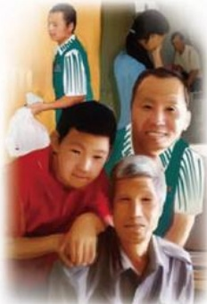

# 一路走好

作者：二橡胶退休工人

东来，请允许我这样称呼你！

你的那篇《和大家说说心里话》，我是含着眼泪看了三遍。你说的一点儿都没错，很多事我都记忆犹新，一点儿都不假，在我脑海里像放电影一样，一幕幕又浮现在我眼前。我仿佛又看到了任再生胶班长、工段长，车间主任的东来；又看到了不干主任而和你的朋友打牌、喝酒，蹬着缝纫机做活儿的东来；又看到了错买小偷的烟，卖掉后挣了千把块钱，而后又被关在一间屋子，两个手带着铐子的东来；又看到了从西安回来，你被罚得倾家荡产，你和你同去的弟兄被打得回来几个月还是浑身疼痛而又欲哭无泪的东来……直到

现在我写这些，我的心还在颤抖。以前的东来真的太坎坷了，真的！

东来，一幕幕映过之后，我又想对你说点儿什么。或许你会问我是谁，我是曾经在二橡胶下岗，如今已退休在家几年的一位老职工。我虽不在胖东来工作，但我很感激你，因为你为那么多下岗职工分忧解难，厂子现在虽然已经破产没有了，但厂子里的人，都感谢你，你总是悄悄的帮这个帮那个从来不图回报，让大家都有饭吃。你深知下岗职工的难处，他们上有老，下有小，下岗后生活充满无助与无奈，是你给了他们就业机会。我弟弟就在胖东来工作，他常说：“不是胖东来收留我，谁要我们这些年龄大又无技术的人，福利待遇还低高，要不好好干，对不起胖东来。”弟弟说的是真心话，他说的是很多下岗职工的真心话、实话。“你心我心，将心比心”，所以下岗工人在胖东来工作都干得比较好，因为他们非常珍惜这份工作。这些是我看到和听到的。

东来，我说了这么多没用的话，我还想说，你的那篇《和大家说心里话》，让许昌市民更加了解你，了解胖东来。相信你一定会把胖东来做成最好的、最稳的、最快乐的。我儿子明年就大学毕业，到那时我会去找你，把儿子交给你，让他来胖东来补上做人这一课。

写着这些字，我的手一直在发抖，感动，感激都有。我会远远地，默默地为你祈祷，为你祝福，东来你要注意好自己的身体，大伙需要你，祝福你的道路越走越稳，平安顺利！祝福胖东来的明天会更好！

## 我们一家人

