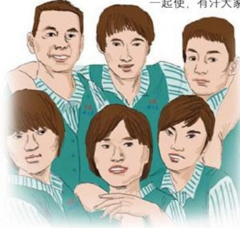

# 我们一家人

作者：超市部/马慧茹

每次，供应商大姐来送货的时候，都会直面问我：“慧菇，你们咋恁一心，好象这个生意是你们自己的！”看着大姐一脸的迷惑，我就会冲着她甜甜地一笑说：“大姐，这个生意就是我们自己的，做好它，我们就会拥有一切。”

而送干货的老安大哥也总会对我们课长说：“继红，看看你带的人，多跟你一心。”听了老安大哥的话，我知道，我们既是跟她一心，更是为了工作而一心，为了共有的目标和愿景而努力。

对于供应商大姐和老安大哥的迷惑和疑问，我们区的每位员工心里都会涌起一种自豪感。

你们知道吗？稻田里成熟的麦穗低着头，那是在教我们谦虚，而蚂蚁能抬走大骨头，那就是团队的力量。

在生活广场生鲜处，就工作着我们这样一群团结一心为工作的最可爱的人。而我所在的散装课，更让我感到大家是一个不可分割的整体。

在我们区，三个人一个班，六个人组成一个散装课，每个月的销售任务就需要我们用集体的力量去完成。所以在工作中，细致的分工是必不可少的，但团结合作的工作态度是要铭记在每个人心中的。而我们的工作就是分工不分家，有活大家一起抢着干，有劲大家一起使，有汗大家一起流。当我们的货物从南库回来时，我们区

男员工赵亚军和段建强，就会楼上楼下地扛上搬下。炎热的夏季，汗水顺着脸颊直往下淌，衣服像在水里洗过一样；寒冷的冬季，手上崩裂的血口子让人看了就心疼，汗水湿透着厚厚的冬装。而他们依然像大力水手一样快乐地干着，笑容也依然荡漾在脸上，从来没听他们喊过累，也没见他们在工作中打过退堂鼓。而在不卸货的时候，又要喊特价，促销售。称台员工也是一样忙碌地工作着，既要站好称台，又要兼顾理货，上货，环境卫生等工作。只要在当班期间，这些工

## 顺路车
