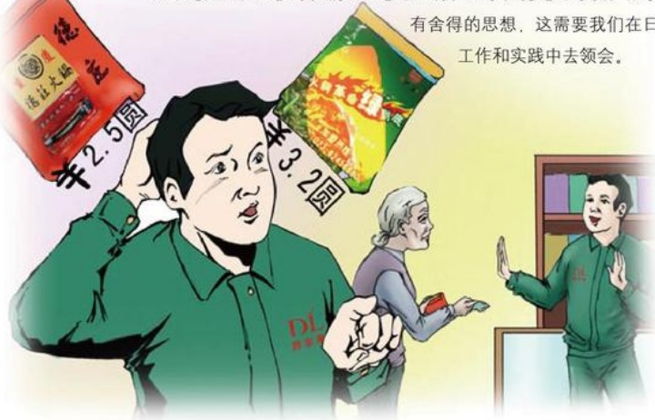

# 替顾客作主

作者：超市部/李轩

那天上午8点左右，当我走到大门口时，看到一位老太太需要帮忙，我走上前。老太太询问有没有搞活动的玩具中网购，想给她孙女买一个，但此时孙女睡着了，自己不方便。我说：“没问题，您稍等。”接过顾客的3元钱，我进卖场买了一个，递到她手中。这时，老太太又说：“小伙子，又要麻烦你了，你这儿有没有2.5元一袋的火锅料呀，刚才忘买了，能再帮一下忙吗？”我毫不犹豫地说：“没问题。”顾客又给了我3元钱，我找到区里的员工，一问才知道那是德庄火锅料，2.5元一袋是搞活动的价格，活动已经结束，现在销售的是3.2元一袋的精品德庄火锅料。我决定将火锅料买下，钱给顾客垫上，如果她非要2.5元一袋的，我再给她0.5元不就成了。我把手中的小票和火锅料一起交到顾客手中说：“娘，2.5元一袋的没有了，这是3.2元一袋的，味道也不错，你买回去试一下。”她接过来一看就是这种，连忙说：“谢谢你，我再给你两毛钱。”我连忙说：“不用了。”

虽然只是两毛钱，但如果当时拿着顾客的3元钱，啥都不买，说钱不够，再交到顾客手中，让顾客自己做决定，麻烦不说，想必她会误认为你是专门来要这两毛钱再帮她买的，这就与我们的理念相违背。遇事要抱吃亏态度，做事要

## 暖冬
