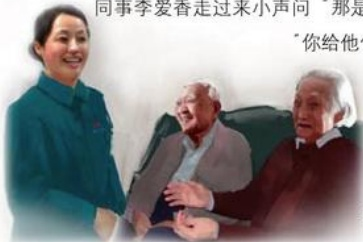

## 暖冬

作者：超市部保洁/于俊霞

今年灯节，正月十五那天，十一点左右，正是客流高峰期，我看到玉兰油专柜西边坐着两个老人，看上去大娘像是很痛苦的样子，在那儿呻吟，大爷在旁边很焦急的搓着手，无奈地望着大娘。

看到这情景，我不由地停下来问：“大娘作了”。大爷抬头望着我说：“有病，几种病，并发症，看不好了。”老人说这话的时候唉声叹气，很无助的样子。

当时来来往往的顾客特多，坐在那里不方便，我招呼大爷一块把大娘扶到通道坐下，给大娘端上一杯热茶，说：“大娘你想吃啥，咱二楼是超市，啥都有，货可全了，让大爷上去给你买一些。”刚说到这不料二老竞掉起泪来，我忙劝他们，大爷稳了稳情绪说：“妞啊，也不怕你笑话，你大娘这个病啊钱都花光了，也没治好，算了也不治了，就等着去的那一天啦，你大娘也没别的心愿，临走一心想来生活广场看看，以前没来过，也没钱坐车，我用车把她拉来了，刚进来就走不动了。”听到这里我的心里好酸，都不知道说些什么来安慰两位老人，只是陪着掉眼泪。大爷看我这样说：“妞，你去忙吧，俺坐一会儿就走了。”

两位老人好可怜，来生活广场就为看看，满足大娘临走的心愿，不行，我不能让他们就这样回去！天下谁没有父母，说不如做，我一摸口袋，好，还有二十块钱，就递上去说：“大爷，你看太少了，你带大娘到三楼吃顿饭再走吧。”二老睁大眼睛看着我，接过钱说：“谢谢妞，谢谢妞，我可没想到这人会这么好。”我忙又拉住二老说：“您们不用

谢，来到这就和到了家一样，要是喜欢下次再来”，两位老人笑了，我也笑了。这时

同事李爱香走过来小声问“那是你亲戚”，我笑没答，“是你认识”，我又笑。

“你给他们钱，我还想着是你认识哩”，“哦，是啊，我们认识。”我们四人都笑了。

我虽然是名普通的保洁员，但是我也有自己的目标与梦想，我要努力的工作，在改善自己生活水平的基础上，尽自己最大的能力去帮助更多的人。让他们能分享到我们所给予的爱与温暖。

## 胖东来印象

