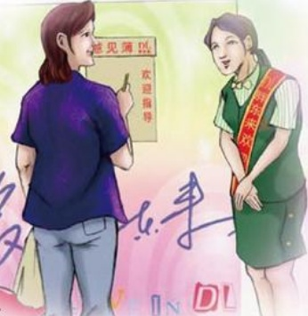

# 胖东来印象

作者：郑州市/杨环

常住“商城”郑州，熟视了来自法国的“家乐福”，来自泰国的“易初莲花”，来自台湾的“丹尼斯”等大型连锁超市，却又常听许昌籍的同事说起许昌“胖东来”，心里颇不以为然，心想，许昌一个本土企业，怎能和上述这些国际知名品牌相提并论？不想前不久到许昌小住，却一下子颠覆了我的偏见。7月中旬，我到许昌小住三日，从踏上许昌土地的那一刻起，就感觉到“胖东来”无处不在：几乎每条街上都有“胖东来”的分店，公交车售票员嘴里吆喝着“生活广场”，同车的乘客打电话约朋友去逛“生活广场”，亲戚家的储藏室里随处可见“胖东来”的塑料袋……可以毫不夸张地说：“胖东来人”已经深入到许昌千家万户的生活中！

我于一天上午9点钟来到“胖东来生活广场”，此时这里已经人声鼎沸。停车场入口处排起了长队，前一个顾客离去下一个顾客才能有停车位。一楼二楼的顾客都是提着购物筐抢购，特别是二楼生鲜区，好像那些商品跟不要钱一样，那旺盛的人气绝对不亚于郑州任何一家知名连锁企业。

“胖东来”的优质服务也让我有了真切的感受：自动电梯处上下都有人扶，购物多时有人主动帮你送到停车场。本人已是“而立之年”，

“胖东来”的姑娘小伙儿谁见了都叫我“姐”，反倒让我有些不好意思了，我挑了点水果，在过

磅处排起了长队。负责过秤的姑娘忙得一头汗，

脸上却挂着甜甜的微笑。我忍不住偷偷问她：“你每天都这么忙吗？累不累？”姑娘笑着说：“姐，这是我的工作哦，不累。”就这个同样的问题我又分别询问了收银员、保安和看车子的大妈，他们的回答竟然惊人的一致。看来“胖东来”的确团队意识也很强。

作为一个外地人，我在许昌三天，对“胖东来”也只是走马观花，要说印象也许是
