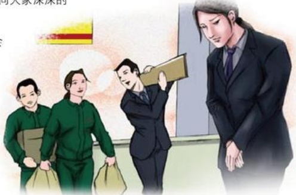

肤浅的。我给“胖东来”的成功归纳出几个原因：一是以人为本，善待员工，员工们至上司很有“亲和力”；二是真诚对待消费者，无论在卖场哪个角落，都能听到对顾客亲热的打招呼声；三是诚信经营，真正做到了“用真品，换真心，不满意，就退货”，如此这般，消费者购物当然首选“胖东来”了。返回郑州前，我又去“胖东来”一逛，临别还专门在顾客留言簿上写下了由衷之言，在盛赞的同时，也建议“胖东来”每个收银台都设“刷卡器”，“胖东来”的小姑娘真诚地对我说：“姐，谢谢您！”

## 晨会

作者：服饰部/师小华

卖场调整货架需要早班的人加班帮忙，忙活了一阵子后，能看见的人只有几个了。于是主管路路便问剩下的几个人：“她们都去哪了？”“偷偷走了吧？”几乎是异口同声的说。路路的脸色沉了下来，但没有发火。过了一会儿，不见的人陆陆续续的抬着该整理的物品下来了，“还想着你们是半道开溜了呢。”路路的脸上笑容绽放。

在第二天的晨会上路路姐当着大家面道歉，说这几天卖场调整，大家辛苦了，她不该误认为大家偷偷的走了，心里很生气。当她看到大家抬着物品下来的时候，心里暖暖的，真想大声说：我爱你们！她很后悔自己的举动，她不该误会大家，因为我们是一个团队，是一个“有活大家一起干，有快乐一起分享，团结一心相帮相鞠了一躬。

这也许是我们最感动的一次晨会

了。领导能与员工坦诚相待，即

使有误会，也会消除的。因为

我们是胖东来人，我们有自

己的信仰与追求那就是，公

平、自由、快乐、博爱。

## 妻的感动
