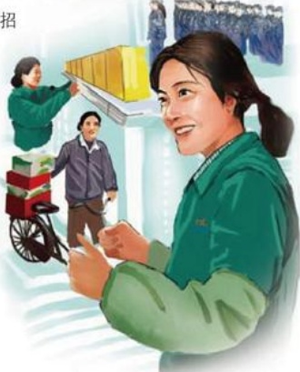

# 妻的感动

作者：员工家属/张宁桥

妻钱淑琴，现在胖东来生活广场三楼百货区工作，每当妻说起自己的昨天与今天，都会潸然泪下。

妻原来的工作单位由于经营不好，于2000年破产了。接到失业下岗通知的那一刻，妻哭了，毕竟从此要离开自己工作十多年的岗位了。妻说：“我该怎么办？”看着妻黯然神伤的表情，我极力安慰她。很长一段时间里，妻一直无法从下岗的阴影中走出来，一直感觉很茫然，很苦闷。以后在家的日子里，妻一直在努力，希望能重新找到工作，但终因年龄、技能等诸多原因而被拒之门外。妻闷闷不乐的心情，影响了我们已快8岁的女儿，我希望能早日有个转折，打破这种沉重的气氛，重新找回昔日欢乐的家庭。

2002年7月初，妻经人介绍在胖东来公司填了招工表格。在等待面试的时间里，妻一直在问我：

“能行吗？”看得出此时妻的心情很忐忑，可以

看得出此次面试的通过对妻的重要性。

妻从面试的房间出来，快步跑到我的面前，

紧紧地抓住我的手，言语中透着无比的喜悦：“你

知道吗，我被通过了！”泪水随即夺眶而出。

以后开始了严格的军训。7月夏天，骄阳似火，看着妻被晒得黝黑的皮肤，看着妻被汗水打湿的发际，我关心地问：“苦吗？累吗？”“不苦，不累！”妻坚定地说，“我坚信军训会培养我严格认真的工作作风和吃苦耐劳的毅力。你知道吗，今天公司领导冒着酷暑来看望我们了，并送来了许多的防暑物品。”

随后的时间里，妻进入了严格的实习阶段：先后经历了电器量贩的搬迁、服饰鞋业大楼的装修、配送中心物品的搬运等工作，始终没有听到妻说一声苦。

2002年9月9日，妻被正式分配到胖东来生活广场三楼工作，这天清早，妻穿着崭新的工装，静静地站在镜子前，许久，妻哭了……
