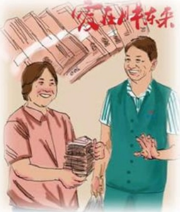

姐，你来了！ $ ^{注} $妻到三楼报到时听到姐妹们那一声声温馨的话语，那一句句亲切的招呼，刹那间驱走了许多的陌生和距离。

中秋佳节，妻带着公司发的福利回家。邻居很吃惊：“呀，这么多！”眼光中透着无比羡慕，忽然间，我发现妻笑了，笑得那么坦然！

妻说：“自从我加入胖东来这个大家园后，经历了许多让我感动的事。感谢东来哥给我一次重新工作的机会，工作对我来说是一种无比的快乐与幸福，无比的踏实与成就！滴水之恩，涌泉相报。在以后的日子里我会辛勤地工作。我坚信我的明天会更好！”

## 信任

作者：超市部/涂振营

这件事使我一直记忆犹新，那是2008年4月26日的中午出去吃饭，刚走到对面中行门口，被一位大姐叫住了：“兄弟帮帮忙吧，把我这袋东西送到对面车上吧。”我看了看她手中的黑色袋子，另一只手并没有其它什么东西，而且这个黑色袋子并不重。心想“这点东西也需要帮忙。”管它呢，即然人家说出来了，就帮人家拎过去得了，谁知道，我刚接过那个袋子没走几步，呼啦一下，袋子破了，好几捆百元大钞滚落在地上，钱！这么多钱！应该有几十万吧，一时间我惊呆了！“诈骗”“假币”“碰瓷”等几个不详

事后我想了很多，我是胖东来的一员，代表着胖东来的形象，老百姓信赖我是因为信赖我这身工装，信赖胖东来这个品牌，这种信赖不仅仅是要我们用努力工作来回报的，更重要的是一种责任，一种对顾客、对社会的责任。

的词顿时涌向了我的脑海。大姐好像看出了我的心事，连忙解释道：“兄弟，对不起，事先忘告诉你了，这是我刚从银行取的钱，我一个女人拿着不安全，所以让你帮忙。”听了她的解释我长出了一口气，悬着的心才放了下来，我们急忙蹲下身把钱捡起来，用黑袋包好，向对面停车的地方走去。路上我问道：“大姐，你怎么这么相信我，不怕我把你的钱拿跑吗？”“胖东来人，我信任。”啊！原来是我身上的工装，让她对我产生了信赖。

## 想哭就哭吧
