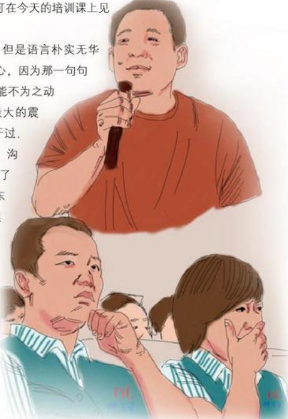

# 想哭就哭吧

作者：超市部/孟建涛

“男儿有泪不轻弹，只是未到动情处”。看到东来哥流泪，我的心也被深深地震撼。我想对东来哥说一声：“东来哥，想哭你就痛快地哭吧！”

以前没见过东来哥，只听说他经历坎坷，经过多年的奋斗之后才取得了今天的成就，心想他肯定很严肃，也很有派头，可在今天的培训课上见到他，却完全出乎我的意料。

东来哥说话虽然逻辑性不强，但是语言能深深打动了在场的每一位员工的心。因为那话语发自肺腑，饱含深情，让人不能不为之动容。东来哥哭了！这是对我心灵最大的震撼。在此之前我也在其他私营企业干过，从未见过哪位私企老板和员工谈话、沟通时会哭。东来哥哭，是因为看到了十几位离开公司的员工又回来了。东来哥很自责自己，说是自己对不起他们，没带好他们，责怪自己和员工沟通太少，他们的走说明公司还有很多失误等等。其实作为一家相当规模企业的老总，每天面对的事情很多，那么多员工哪能每个都照顾到。但他却丝毫不为自己找理由，不去责怪那些员工。这一点让我佩服也很感动。东来哥哭了，让我看懂了他也是一个很平凡的人，很重感情的人，也需要别人的理解，他也需要别人的安慰。

这意想不到的一切让我坚信：跟着东来哥——没错的！

## 回家
