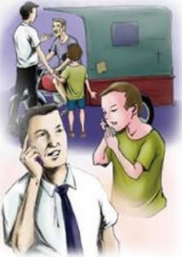

## 回家

作者：服饰部/吕彤

那一天，我像往常一样在东门口站岗。

下午六点左右，从卖场跑出来一个七八岁的小男孩对我说：“叔叔，帮我找找姐姐吧？我找不到她。”“好的，小朋友，来，站叔叔旁边，我帮你找姐姐。”我通过店内广播在卖场寻找了几遍后，依然没有见到小朋友姐姐的到来。这时天快黑了，看到小朋友焦急的表情，我心里也很担心。我就问：“你家人的电话你知道吗？”“不知道！”“那你家在哪儿呀？”“八一路。”随后我就领着他到门口找了一个我认识的三轮车，临上车的时候，我给师傅5元钱，并把我的电话号码留给那个小男孩，对他说：“到家后一定给叔叔打个电话，让叔叔知道你到家了。”回到卖场，我心里有些担心，一会儿一看表，都已经十几分钟了，怎么电话还不响呢？正当我焦虑的时候，突然电话响了，小男孩的声音又回响在耳边：“叔叔，我到家了，谢谢你！”接到这个电话，我悬着的心才安定下来，心里特别幸福和温暖。

侯芳编者按：

一方水土，养一方人。胖东来肥沃而独特的文化土壤培养了我们每一位胖东来人，从高层到员工，我们能以良好的心态，以坦荡的胸怀迎接每天的挑战，经受了顾客的考验，虽然我们不敢讲已经读懂了人生，读懂了社会，读懂了市场，但可以自信地说，我们正在成熟，不在幼稚，不在迷茫。虽然我们同过去一样，很忙，很累。但忙得有序，累的快乐，眼前有了开阔的道路，有了更明确的目标。今天，在这里，让我们每一位优秀的团队舵手主激情开航。

## 我给顾客做榜样

