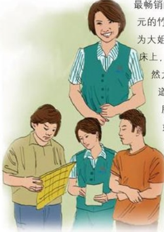

# 我给顾客做榜样

作者：新乡广场/梁潇

那时正值凉席打折的日子，我接待了这样一位顾客，这位大姐是在一位同伴和一个男孩的陪同下来买凉席的。大姐一进门我便热情地接待了她们，我耐心地向大姐讲解了今年最畅销的几款凉席。在这几款凉席中大姐相中了两条300多元的竹碳席，我一边夸她有眼力，一边飞快的跑到仓库，为大姐拿凉席。凉席拿来了，我和大姐一起将凉席平铺在床上，让大姐挑选。大姐和她的同伴一起仔细地查看，突然大姐像发现新大陆般大声说：“你看，凉席中间那道白是什么？”我俯下身一看原来是凉席中间粘合的胶，这是每款凉席都会存在的问题，于是我笑着对大姐说：“大姐，没事，这是凉席粘合胶，不是质量问题，您回家用热毛巾一擦就会掉的。”这种解释我在卖凉席中经常给顾客解释，买凉席的顾客也都认同这个解释。谁知大姐听后竟然不满地说：“什么？我买回家还要用水擦，现在水这么贵，我还嫌浪费我们的水呢。我可不擦，你再给我换条凉席吧。”见她这么固执，我又跑进仓库一下子拿了两条凉席让大姐挑选，第二条席因为是碳化处理过的，每条席颜色都不一样，不仅没有第一条席漂亮而且上面也有胶，大姐还不满意。第三条席上被大姐发现一根竹丝断了还是不满意。于是我对大姐说：“大姐，您看，这几条席上都有胶，挑来挑去还属您挑的第二条席好呢，颜色又好看又大方，又没有断丝现象。”大姐好像被我说动了，可她的同伴却说：“凉席正卖的时候，你们就这三条席了？仓库还有没有货了，再拿两条让我们挑挑呀，我们花这么贵的钱，让我们买个不好的席？”听了她的话我真不知该说什么好，只是说了句：“我再去拿两条来。”强忍怒气来到仓库又搬出两条席，第四条席还不错，没什么毛病，颜色也比较好，还是上面有一点胶，大姐检查完后说：“就这二条吧，开票吧。服务员辛苦你了，让你跑这么多趟。”我听后笑了笑对大姐说：“大姐，你别嫌我啰嗦，凉席

谢谢您，善良的老人
