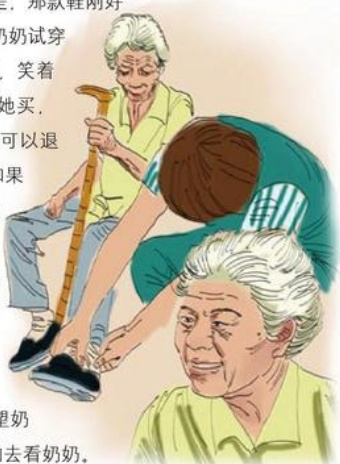

## 销售幸福

作者：服饰部/付芳芳

很幸运加入了胖东来这个团队！胖东来是个大家园，人们来商场购物，不仅仅是买东西，而是一种享受，我们甜美的笑容，足以融化每个顾客的心灵。

没有加入这个团队之前，我就比较欣赏胖东来的服务。“不满意就退货”是东来给顾客购物最好的承诺，我们不用担心如果买回去不如意而不能退货这个问题。前段时间，我接待了几位特殊的顾客，一位是那天刚好过生日的老奶奶，另外两位是打扮得很新潮的孙子和他的女朋友。老奶奶刚好要过70大寿，孙子想给奶奶买双鞋作为生日礼物，所以他在认真地挑选合适的鞋子。他找到了双比较轻便舒适的鞋让奶奶试穿，在试穿的过程中，我发现老奶奶的脚也是在旧时代被裹了脚，几个脚趾头聚在一起，脚很瘦很薄，她所试穿的那款鞋穿上并不合适，根本都撑不起来，而且走着有点想掉的样子。这些我全都看在眼里，很快地，有一个鞋扣，不容易掉，而且整体感觉得特别稳重。老奶奶试穿后非常满意，她说最喜欢在胖东来买东西了。男孩听了，笑着对我说：“奶奶呀，就是这样，我说在家附近的鞋店给她买，她还不愿意呢！非要来胖东来买，说有保障，不满意还可以退货。”我听到这，连忙说：“让奶奶回去再试穿一下，如果不喜欢或不舒服的话都可以再拿过来。”男孩很高兴地为奶奶买了这份礼物，在闲暇之余，我与老奶奶愉快地交谈着，夸她真幸福，孙子这么孝顺。老奶奶笑得合不拢嘴，说和我说话很开心，下次买鞋还找我。我说不买也可以来呀，没事的话来转转，还锻炼身体呢。就在这愉快的气氛中，告别了他们。

现在想起来，我心里挺内疚的，好长时间没回去看望奶奶，不知道她身体好不好，有空的话，一定买好多好吃的去看奶奶。

帮别人挑选商品也是一种幸福，当你看到顾客脸上挂着满意的笑容时，就会特别的欣慰，特别的幸福！

## 雨夜的感动
