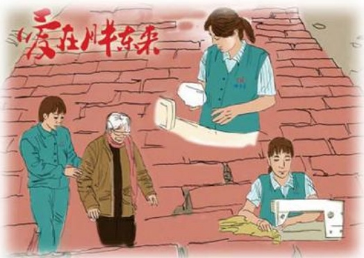

# 莫以事小而不为

作者：新乡电影厅/胡丽娜

下雨了，在停车处与一号楼的那条道又变得泥泞不堪，坑坑洼洼的土路上满满的雨水。每个推车的员工都是很艰难地把车“拯救”了出来。那天推车，无意中发现小路上铺了砖头，边角角都砌得那么整齐，刹那间心头变得暖暖的。这小小的一件小事，但却给大家带来了幸福的感觉。小事往往不被人重视，以为微不足道，其实大事都是有小事积成。从一棵参天大树的成长过程看，它一开始只不过是

一根细小的枝条而已。古人语“合抱之木，生于豪木”，讲的就是这个道理。小中见大，能反映出事物的本质特征。伟大的气象学家竺可桢，几十年如一日，每天坚持记下气象记录，就在他病重之时亦是认真地坚持做记录，在外人看来每天记下的天气情况既枯燥又无聊，而这样记日记却对气象事业做出了巨大的贡献。可见，伟大来自平凡，平凡孕育伟大。

你看，那边电梯口处保安及时地在搀扶老人！你看，这边收银台给路远的顾客多套了个袋子！你看，售后的员工认真、热情地帮顾客免费地修改衣服！扭过头来，保洁员工弯着腰用扇子扇拖过的地面……顾客坐在休息椅上惬意地聊着、笑着。真好，我此刻觉得成为一名胖东来人真好！这真正体现了胖东来人的价值。“莫以事小而不为”是每个胖东来人的高品质，我们愿像一群蜜蜂一样“忙并快乐着”。下班了，“又下雨了”，员工们飞奔着去推车，我笑了，你也笑了，天也笑了！

一个拥抱
