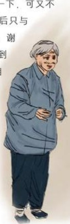
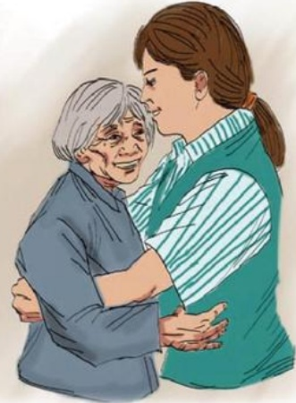

# 一个拥抱

作者：百货任新霞

每当走在路上看到一些腿脚不方便的老人，就想起了她——那个大妈。不知不觉在胖东来工作将近两年了，遇到她时我还是胖东来的新人。那天，天气有点闷热，突然，一位老人一瘸一拐地向我们卖场走来，我迎上去：“您好！请问您需要什么？”老人听到我的话后抬头看了看我，嘴里说着：“走了好几个卖场，终于有一个人和我说话了。”然后又说：“闺女我想买双凉鞋，可...可又怕被骗。”我说：“那我帮你挑一双吧！您看这双怎样？来试试吧！”大妈一试笑了起来：“真合适，质量怎么样呀？”您放心穿吧！它的质量还可以。”大妈说：“就要这双吧！”说着就从口袋里摸出了三张皱巴巴的拾元人民币，一边摸一边说：“哎！闺女你不知道呀，俺家的老头子才去世不久，家里就我一个人孤苦伶仃的，多少钱呀？”“二十五”大妈又说：“闺女，是三十七吧？我就不要了，钱不够。”您拿去吧！您什么时候有了钱再给我吧！老人说什么也不要，最后在我的坚持下她拿走了。

大妈站了起来，想来抱我一下，可又不敢，也许是怕我嫌她脏吧！最后只与我轻轻地拥抱了一下。“谢谢，谢谢，你真是一个好人，以后我只到

胖东来来买东西。”老人含着泪走了，仅仅7元钱而已。

那一刻，我的心颤抖了，

做服务不仅仅是卖东西，老人给我上了一课，让我懂得了，

服务无止境的道理，是啊！我们要做的还有很多，只要我们

做一点点，生活就会更加美好。

## 一 把雨伞
