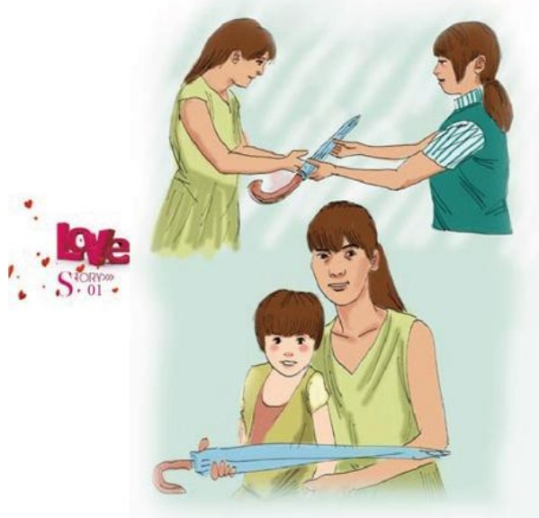

## 一 把雨伞

作者：新乡百货/杨建华

夏天的天气是多变的，那天下午时天气还是很闷热，傍晚的时候就开始起风了，风刮得好大，把大门的皮帘吹得很高，天空也黑了下来，好像8点多钟的天色一样，不一会儿狂风暴雨便呼啸而下，轰隆的打雷声一直不停，这时我看见一位大姐，正走正打电话：“乖，别哭，妈妈现在就回去，你别怕，你等一会儿妈妈就到家了……”大姐很焦急的样子，走到门口又回来了，外面依然下的很大，看到大姐心焦急的样子，我可以想象她的孩子在家哭的样子，我从柜中拿了把伞，走到大姐身旁说：“姐，你急着走，就先用我的伞吧！”大姐看着我，再看看我戴的胸卡，激动地说：“谢谢，谢谢，要不是孩子一个人在家，我也不这么急，还是胖东来好，伞一定还给你。”我连忙说：“不用，不用，您先拿着用吧！”大姐再我的目光中，走出了大门，消失在雨夜中……

过了几天，大姐又来到我们专柜，带着女儿来还伞了，还一直对女儿说：“就是这个阿姨把伞借给妈妈的。”小女孩有点腼腆，冲着我笑，大姐说：“还是胖东来好，以前光听人家说，这回我可见识了。”我说：“这是我们应该做的。”一件很小的事情，举手之劳，却能打动顾客的心，让顾客看到了我们，了解到我们，只要我们从点滴做起，每天做一点点，服务就会向前迈一步。

## 三 年亲情
