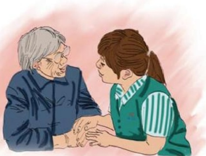

# 三年亲情

作者：电器部/袁银芳

姨，你好！

“银芳，你前几天旅游啦！我来找你没有见到你。”

公司组织集体旅游，我去青岛玩了两天。

咱俩有2个月没有见面了吧，您身体可好？有需要

帮忙的吗？

“我的心脏病复发住医院了，我今天来就是问问你，我用微波炉炖肉的方法对不对，我还想再买个电磁炉。”

我给阿姨讲了微波炉调火力炖肉和用菜单炖肉怎样操作，又用纸给她记录下，因为阿姨80多岁了，以防回家忘了，所以每次我给她讲机器操作之后再用纸条给她记下来，几年下来，阿姨的小包里可以拿出一叠我给她记录的小纸条。讲了微波炉，我又领姨去买了一台电磁炉，临走的时候姨说：“银芳，你真有耐心，讲解得仔细，你给我介绍的微波炉，电饭煲，豆浆机都好用，价格不贵，质量也好，你对我真好，我们都3年的交情了，以后我来胖东来买东西还找你，你哪天休息了到我们家来做客吧！我给你用微波炉做自己拿手的好菜。”

是啊！我们都有3年的交情了，记得2005年春节前一天，我正在给一位顾客介绍搞活动的一款美的微波炉（电脑操作板），这位阿姨走了过来。我与她打了招呼后一直在讲解，前一位顾客成交之后，阿姨说，我本来不想要电脑操作板的，听了你细心的讲解，我感觉这一款机器操作也很简单，我也要一台这款的。于是，我又给她讲了一遍，姨买了微波炉，满意地回家了。

之后，姨几乎每天都来找我，让我教她一天做一个菜，讲完之后，我再用纸把步骤写下来，方便她回家操作。不知不觉3年过去了，现在每次阿姨走进商场，同事就会对我说：“银芳，你姨来啦！”新同事都认为是我亲姨。

这位可亲友善的姨让我明白：工作中一定要有耐心，不急不燥，做到细心讲解、服务周到，把顾客当上帝来尊敬，当作亲人关心，做到人到、心到、感情到。这是我们胖东来人特有的一种精神和服务理念，也只有这样才能赢得顾客的信任，才能让我们在工作中也多一分浓浓的亲情。

## 心灵最深处的纯净

