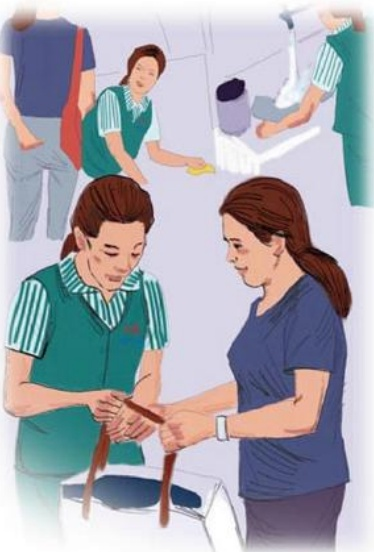

# 心灵最深处的纯净

作者：新乡广场保洁/杨华

我相信每一个东来人都能做好自己的本职工作，可让顾客满意的同时，怎样体现东来人的亲情和超值服务？我们保洁部的一名普通员工——秦长莲用自己最朴实的行动给出了答案。

那天和往常一样，保洁员在卫生间里打扫卫生，一位女士急匆匆地跑进来，双手放在

后面像遮掩什么。细心的长莲发现这位女士洁白的裤子上有一大块血污，原来是“好朋友”的不期而至让这位女士措手不及。只听这位女士说：“这该怎么办呢？”我们的保洁员说：“别担心，我这里有卫生巾。”说着就在第一时间送上了最贴心的帮助，然后接着说：“这儿有凳子，你坐下把裤子脱下来，我给你洗一洗，很快的。”这位顾客说：“那怎么行啊，这么脏的裤子让你洗多不合适。”我们的保洁员说：“那有什么。”说着，拿着裤子就去洗，并且在烘干机下面仔仔细细地把裤子烘干，然后双手把裤子送给了顾客。保洁员的举动让顾客感动了，顾客握着长莲的手说：“谢谢你，只有在胖东来才会有如此优秀的员工。”小小的举手之劳，帮助顾客化解了如此难堪的尴尬局面。在顾客需要的时候，我们的保洁员没有任何迟疑，不仅送去了贴心服务，还送去了亲情和超值服务。当顾客执意要表扬的时候，她说了一句最朴实的话：“这点小事算什么，只要你满意，我就很开心。”其实工作中，只要用心就会做得更好。

## 电器在新乡的这3年
