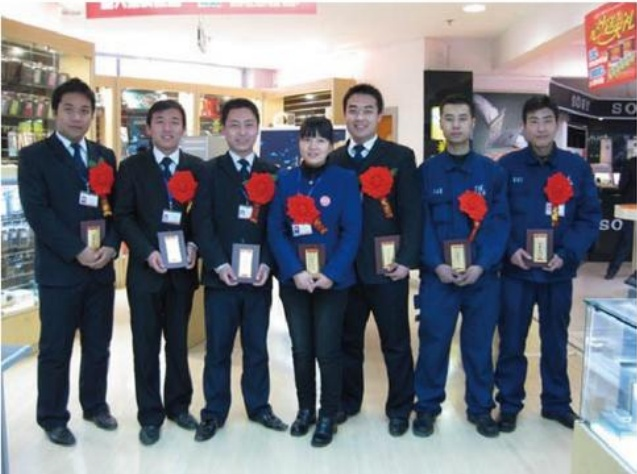

目标实现了，才可能实现自身的目标。只有这样才能做到“上下同欲”，才能保持团队的团结。打个形象的比喻：员工上了你这条船，你必须在他们上船后告诉他们我们的目的地是去往哪里，到达后我们能够获得什么，否则员工会感到迷茫和疑虑，对自己的未来没有方向感和安全感。

## 建立一个好的沟通制

有意见，有矛盾，出现问题相互推诿，可能出现更大的问题，这些都是沟通不够的表现。我一直都相信没有解决不了的问题。作为管理人员，打造高效能营销团队，就必须要定期与下属进行沟通，由于营销人员地处市场一线，因此他们需要关心，需要抚慰，应不断给予团队成员鼓励，挖掘其潜能，激发其斗志。要切身站在员工的立场上思考问题，如何协调好员工的工作情绪，以及建立好上下层之间的人际关系，让员工感到这个团队是温暖的。其次要充分的给予员工授权，这要求你对每一个员工的能力和业务技能有足够的认识与了解，给予团队员工适度的自行工作空间，方能调动团队的主动性与积极性。

在我们成熟的过程中，虽然还有很多的不足，但我们坚信，只要奋斗不息，多一些用心，少一些抱怨，我们的胜利就在眼前。

## 情浓电影厅
