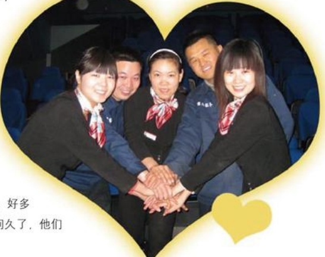

# 情浓电影厅

作者：新乡百货电影厅

岁月匆匆，时光飞逝，转眼间胖东来百货已走过了三个春夏秋冬。在这三年的风雨历程中，电影厅在公司领导和兄弟部门的支持下，在影厅全体兄弟姐妹的打拼下，在我们的观众认可与帮助监督下，已由一颗细嫩的小苗长成了大树，并创造了在全省奥斯卡院线中地市票房第一名的佳绩。

08年的平安夜，胖东来百货到处人头攒动，电影厅的休闲走廊也挤满了等候入场的观众，看着售票处顾客一票难求的表情。我再一次为胖东来特有的经营理念折服。“你心我心，将心比心”我们对顾客好，他们能感受到。想着平日为观众自备了急救药物箱，为视力不好的观众准备的各种眼镜。逢年过节，为顾客摆放的糖果小点盘，夏季里的

冰冻西瓜等等。我们做了，而且不是自作多情，是观众所需。观众需要的还有很多很多，我们都会认真去想，认真去做。此时看看我们不停的忙碌，看看顾客开心的笑脸，感觉周围一切很美，心情很好，商业真的可以为人带来文明和快乐。

仕电影厅，通过电影，通过服务，对多会员与观众都成为了我们的朋友。时间久了，他们生活中的感人故事，我们也略晓一二。

有一个会员，他是军队领导，在汶川地震中，他连续一

个月都抗战在灾区一线，先前他们总是一家三口来看电影，得知情况之后，我们电影厅再见到他，总会以最真诚的敬意邀请他一家免费观影，但他婉拒了我们。他们一家一如既往地购票观影，并很自觉地遵守我们的观影制度。在他们家身上，我和我们兄弟姐妹更懂得了责任与约束。
