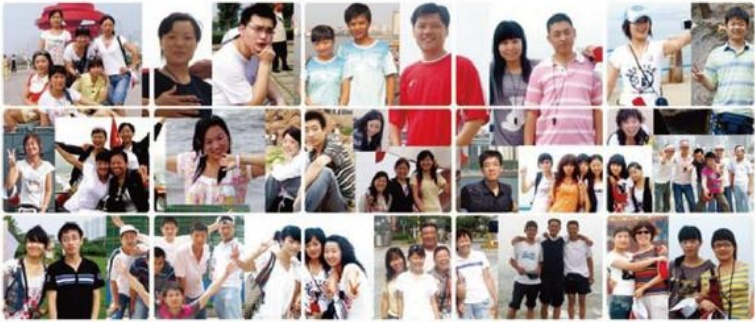

一名会员手捧着我们赠送的圣诞礼物，刚起身离开，又转身折回。热情而急切的对我说：“你们二号厅的放映机器有小故障，声音仔细听，有点不对劲，你们检查检查……”越来越多的观众开始关注，帮助、指导我们。他们说，在我们电影厅能找到很自然很亲切的感觉。他们很喜欢这儿看电影，更放心自家的老人和孩子来这儿观看。

回想起三年前土建时的场景，十来个兄弟姐妹在工地上没日没夜地苦干，看着她们一双双布满灰尘的手，我的内心充满了感动，他们是平凡的人，但他们拥有对工作热情执着的态度，我看到了我团队的亮点，我感受到了团队的力量，电影《非诚勿扰》中有这样一句话：二十一世纪什么最贵？和谐是啊！团队内部要和谐，我和大家要和谐，大家和观众之间也要和谐。每个人都很有才不重要，重要的是有才人在一起的配合要和谐。“赤壁”中，周瑜手拿刘备编制的草鞋说道：一根草，轻轻一拉就会折断，而这许许多多的草绞在一起拧成劲儿，任凭你怎么拉，怎么拽，它都不会断。这就是团队的力量。

我们电影厅全体兄弟姐妹饱尝了三年的酸甜苦辣，个个都有成长，有收获。有思想上成熟的收获：有心态上更包容，更感恩的收获：有婚姻，有爱情的收获：有对父母，对家人感恩回报的收获。亲爱的兄弟姐妹们，入了服务这一行，我知道你们也受了不少的委屈，又来自顾客的，也有来自我的，但不管来自哪个方面，相信优秀的你都能够在一次战胜自我。因为你们是强者，新的一年即将到来之际，我祝福大家平安、健康，全家幸福美满。

## 在挑战与磨练中成长
