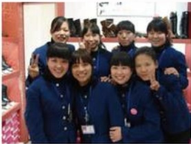

# 在挑战与磨练中成长

作者：新乡百货鞋区

2005年12月新乡胖东来开业，一楼鞋区只有2100平方，根据以往经验汇集了中、高、低档产品为一体，在整体环境上没有进行维护，再加上前期没有认真市调，在品牌和整体卖场布局上有所失误，造成有客流、无销售的状况。但是，总结出不足之后，我们立即采取了措施：

## 采集品牌、优胜劣汰

通过市场调查，新乡市场对金利来、富贵鸟、达芙妮等品牌认知度很高，产品质量过关。于是，马上行动，主动去厂家及地区代理商进行了沟通和谈判，从不信任到认可，在坚持不懈努力下，使金利来、富贵鸟、路贝佳，接吻猫等品牌于开业的3个月内入驻胖东来，给我们带来了众多客流并取得了一定的业绩，所以对每个地区的市场调查应该特别重视并在今后维护好品牌形象，在货品、工作、销售等方面给予一定的支持和帮助，使他们为商场带来更大的效益。

## 调整布局

开业前期我们中低档产品太多，使许多品牌销售逐步下降，这方面的原因是：品牌意识太薄弱，一味的要求只要销售，忽略了形象。根据员工反映情况，顾客反馈信息及市场信息等方面，立即转变了思路，重点放在卖场布局上，对中岛男女鞋区、休闲品牌，进行厂商或个人代理的操作方法，正因为我们相信他们，放心、大胆的交给他们去做，使销售和人气方面有很大改善，所以不怕工作做不好，就怕不去想办法。

## 员工动态

刚入驻新乡，于总亲自召开全体员工大会，给我们指引了一条前进的道路，接下来采取了员工沟通，从称呼上进行了改善，从“XX经理”到“XX姐”一句简单的称谓，拉近了员工和我们之间的距离，没有了领导，只有了向导。利用晨会做一些有意义的活动让大家互动起来，参与在一起并齐心协力朝着一个目标努力。所谓团队精神就是有大局意识、工作精神和服务精神在尊重个人的思想方面着手。但是由于我们使用方法不当，造成许多员工没有真正理解其含义，把大家带的没有激情，除了工作还是工作，俗话说：“没有不好的士兵只有不好的将军。”所以今后在这方面要从自身做起，加强精神文化方面的培养和学习，把他们带成一支英雄的军队。

## 我与企业共成长

