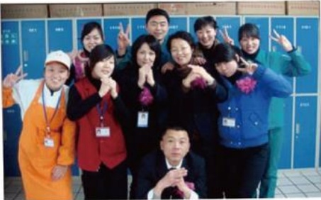

# 我与企业共成长

作者：新乡百货超市部

三年前的今天，牧野大地春意浓，火一样的激情和期盼，我们胖东来百货正式开业了！三年时间说长亦长，说短亦短，流逝的是光阴，留下的是真情。

## 创业篇

记得刚来公司的时候，说真的，一切都没有预期的理想，从最初的军训到许昌总店的培训，再到清理商场留下的建筑垃圾，每天都忙忙碌碌的工作到很晚，很多工作只能靠摸索着干，公司成了我们的家，早上起床就是上班，晚上下班就是睡觉。身体的疲惫，家人的抱怨，曾经让我们迷茫，在这个时候是企业领导的关怀让我们又找到了信心，只有把企业当成自己的家，才会感受到家庭般的温暖。

## 成长篇

记得有这样一段关于描写成长的话：“你并不是一生下来就是一棵树，你一生下来只是一颗种子，你必须成长到你会开花的点，那个开花才是你的满足和达成。”开花结果是件快乐的事，但成长本身却是艰辛的，充满了辛劳、泪水和汗水甚至鲜血，它们渗透在我们生命中的每一个阶段。

进入企业初期，由于对企业文化不了解，体会不到企业

理念的真谛，在领导的关怀下，在兄弟姐妹们的共同努力下，我们开始逐步的进入工作状态，经过一段日子的交流，大家对彼此的性格有了一定的了解，相处也逐渐融洽。每个人都有他独特的一面，每个团队都有他自己的特点，我们只有根据团队的具体情况，发挥每一个人的最大效用，才能把团队做大做强！
