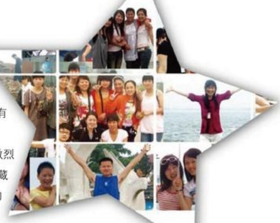

## 感恩篇

企业给了我们一个良好的工作环境、一个工作和学习的平台，给了我们相对优越的待遇，让我们可以全身心地投入到工作当中。曾经有人说：“受人恩惠不是美德，报恩才是。当他积极投入感恩的工作时，美德就产生了。”所以我们感恩，是企业让我们拥有了体现自我价值的平台，找到了自己的人生坐标。时刻拥有一颗感恩企业的心，同事彼此之间关系会更加融洽，配合更加默契，误会和埋怨将在理解被淡忘；时刻拥有一颗感恩企业的心，我们就不会在工作中发生贪图私利、损人利己、消极怠工的事情发生。拥有一颗感恩企业的心，我们便拥有企业这个大家庭，我们便成为了企业真

正的主人，一荣俱荣，一衰俱衰。

## 展望篇

有人说“心有多大，舞台便有多大”，成功永远属于心怀梦想且矢志不移地为之去打拼、去奋斗的人们。当然，这个“梦想”需要一个合理的规划，这个荣耀是所有胖东来人用智慧与付出铸就的。

有人质疑，在现代商场竞争日益激烈的今天，胖东来靠什么取胜？毫不隐藏地说，靠的是优质细微的服务，靠的是一诺千金的诚信！因为我们深知商场的核心竞争力便是服务的竞争。只有诚信，才有认同；只有诚信，才有信誉；只有诚信，才有口碑。未来，道路依然漫长，荣耀只

是“万里长征的第一步”，现状与胖东来人的梦想仍存在着许多的差距，我们将始终恪守“让商业为人类创造更多的快乐”这一企业目标，始终以饱满的热情，为每一位光临胖东来的朋友，提供最完善的服务，矢志不移地为振兴胖东来品牌而不懈努力！

## 心中有爱，温暖前行
