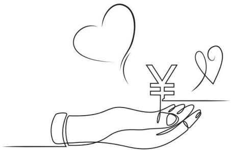

## 考评奖励标准——家庭（孩子）

五级【4~5分】：彼此尊重、彼此独立、没有束缚和包袱，各自活好自己阳光的生命。（自由）

- 本条释义：父母与子女之间是平等的人格和独立自由的个体，彼此毫无束缚地去过自己的生活，社会的个体属性大于家庭的情感属性。

符合的行为：

1、享受自己独立和喜欢的生活，不依赖子女

2、合理科学地安排好自己生活，不让子女操心

3、生病了不傍子女照顾自己，不给子女添麻烦

4、能够安排好自己的养老，请保姆照顾自己或找自己中意的养老院

5、能够安排好自己的后事，乐观地面对疾病或死亡

6、能够引导子女正确面对自己年迈疾病或死亡，不让他们沉浸在悲痛中，乐观阳光地对待

[72]

## 考评奖励标准——理财

