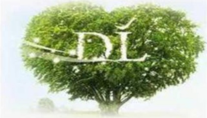

## DÍ

## 亲爱的兄弟姐妹：

欢迎大家加入胖东来大家庭，由于近些年来，我们身边发生了一系列的人身财产方面的事故，给我们敲响了警钟，尤其是因为一些小的错误及疏忽最终导致人身伤亡，非常的令人痛心，不堪回首。平安、健康、快乐是这个社会主题，为了维护我们自身和他人的安全，为了远离伤痛与不幸，希望大家认真的学习关于人身财产安全的知识，吸取各种事故的教训，时刻把人身财产安全放在第一位，做到未雨绸缪，尽最大的可能降低或减少人身伤害。

## DÍ

尊重自己，

做和阳光一样美丽的人

## 01

## 生活

1. 抢劫

2. 盗窃

3. 网络诈骗

4. 交通安全

5. 品行

6. 休假外出

## 02

## 工作

1. 安全

2. 抢劫

3. 盗窃

4. 人身伤害

5. 卖场突发事件

## 目录：

## 一、 生活篇
