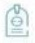
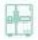
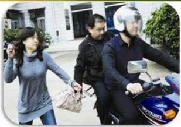
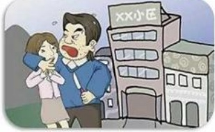

## 第一章：生活

## DÍ

真正的成就员工是培养员工阳光、快乐、自信的生命状态

抢劫

盗窃

网络诈骗

交通安全

品行

休假外出

## 生活篇--抢劫事件

## 第一章：生活

## 一、 抢劫事件：

## 案例：

1、2007年，一员工下班途中因与来接的家人没有相遇而遭到犯罪分子劫持，最终被残忍的杀害；

2、2012年，一员工下班途中因住的较偏僻遭犯罪分子拦路抢劫，幸亏刚好有路人经过，犯罪分子逃跑；

3、2014年，一员工在ATM机取钱时被犯罪分子盯上，后被抢走现金500元；

4、2015年，一员工在和别人合租的房子处遭到犯罪分子的抢劫，员工反应及时转身就跑，随后报警，后警方将犯罪分子抓获。

