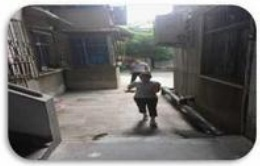
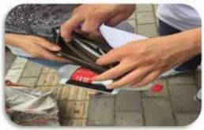
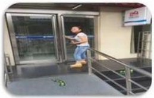

## DÍ

## 容易发生抢劫的情况

回家时有陌生人跟随

贵重物品外露

自助取款机取钱时

行人稀少、环境阴暗、偏僻的地方

## DÍ

## 抢劫事件的预防及处理方法：

1、上下班途中不要戴耳机或者拨打电话：

2、到自动取款机取钱时，注意观察周围情况：

3、在外租房的，和同事合租套房，不要租独门独院或者位置偏僻的房子；

4、外出不要携带过多的现金和显眼的贵重物品；

5、现金或贵重物品最好贴身携带；

6、出门上街，应结伴而行，避免独行晚归；

7、不去行人稀少、环境阴暗、偏僻的地方；

