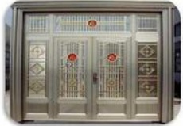
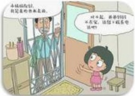
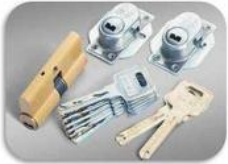
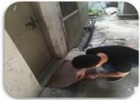

## DÍ

盗窃事件的预防及处理方法

家里安装防盗门窗

外出、晚上睡觉前检查门窗是否关好

教育孩子不给陌生人开门

保管好钥匙，丢失及时换锁

晚上贵重物品不要放在客厅

不要在隐蔽的地方放置备用钥匙

## DÍ

## 盗窃事件的预防及处理方法：

1、家里最好安装防盗门及防盗窗，外出、晚上睡觉前一定要记得检查一下门窗是否已关好，夏天不要因为热不关窗户，以防小偷用杆子或其他工具钩出贵重财物；锁好阳台门窗，防止小偷从管道，围墙爬上来作案；

2、保管好家里的钥匙，不要给外人及学龄前儿童，钥匙丢失或被偷，要及时换锁；教育小孩，培养防盗意识和习惯，教育小孩不要轻易给陌生人开门，引陌生人进门。

3、邻里守望，较长时间外出，应请邻居或者物业关照；发现邻居家有可疑的人、事，应主动关心询问；邻里亲友要相互提醒，长期保持自身防范警惕性。

4、大宗贵重财物切忌存放于家中，最好存放在银行；不要随意在家中设置保险箱，若要设置，应四脚灌注水泥定或者在室内墙固体的暗格之中，并切忌由外人参加暗格的设置安装。若临时需要存放贵重物品，请分散藏放，但请不要放在电视柜、书桌、衣柜、床头柜、床垫底下等部位。

5、存折、银行卡的密码设置切忌设为生日，并与证件、户口簿分开存放，存折、银行卡

