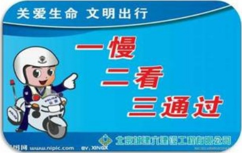

## DÍ

（三）为防范网络欺诈，应注意以下几点：

1、网上购物一定要到正规的购物网站，使用比较安全的支付宝、U盾等支付工具支付。

2、不要在网上购买非正当产品，如手机监听器、毕业证书等所谓的“商品”，几乎百分百是骗局。

3、凡是以各种名义要求你先付款的信息，请不要轻信，也不要轻易把自己的银行卡借给他人。

4、提高自我保护意识，注意妥善保管自己的私人信息，如本人证件号码、账号、密码等，不向他人透露，并尽量避免在网吧等公共场所使用网上电子商务服务。

5、对于需要预先支付费用的网上中奖信息、彩票预测信息和股票投资信息切不可相信。

6、对于QQ、微信中好友的借钱不轻易相信、可通过电话等途径核实后再作决定。

7、不与网上结识、现实中无过多交往、身份不能确认的朋友发生大额的借贷关系。

## 生活篇--交通安全

## DÍ

## 四、 交通安全

## 案例：

1、2013年，时代两名员工下班后没有走人行横道横穿马路，被一辆自东向西的轿车碰撞，导致一人脾脏切除手术，一人颅骨抽出淤血手术，事后两人还要承担交通责任。

2、2013年，广场一名员工上班途中骑电动车与一自行车相撞，自行车把撞住其腹部，造成内出血肋骨骨折两根；

3、2015年，广场一名员工下晚班喝酒后驾驶摩托车没有戴头盔，出交通事故，经抢救无效身亡；

